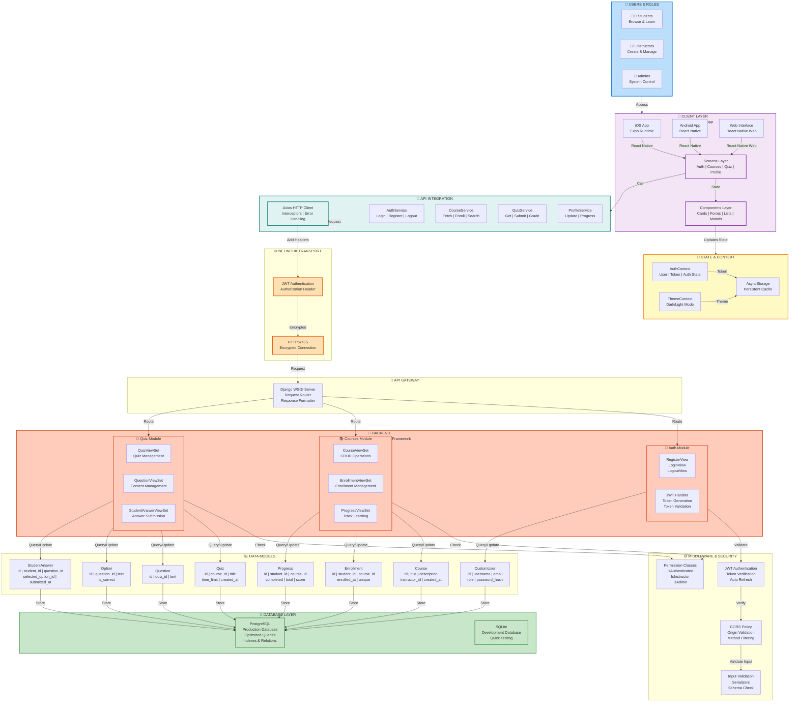
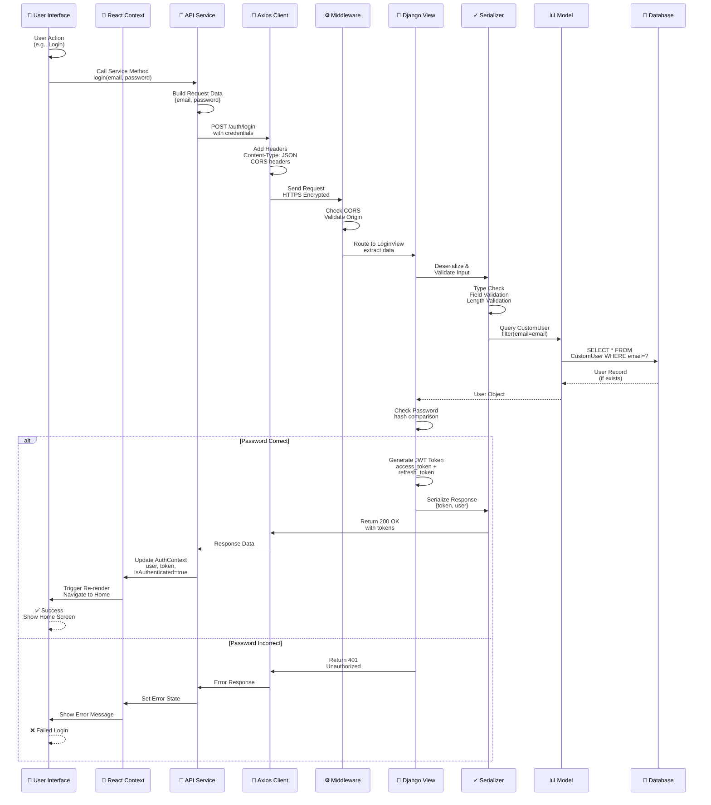
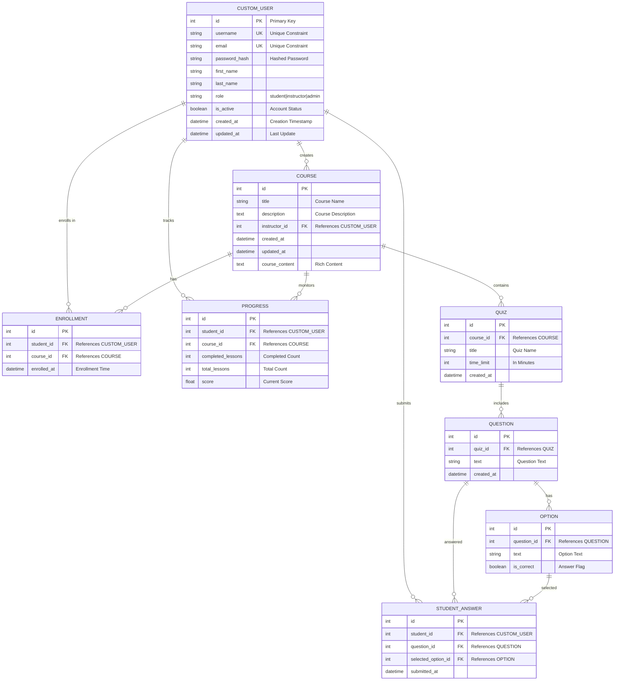
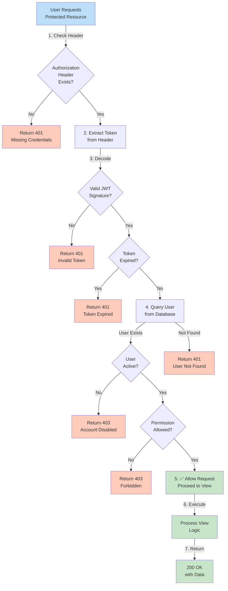
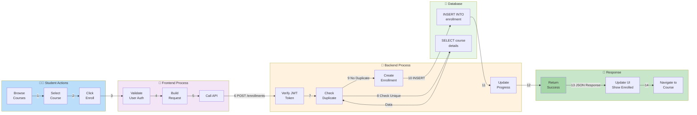
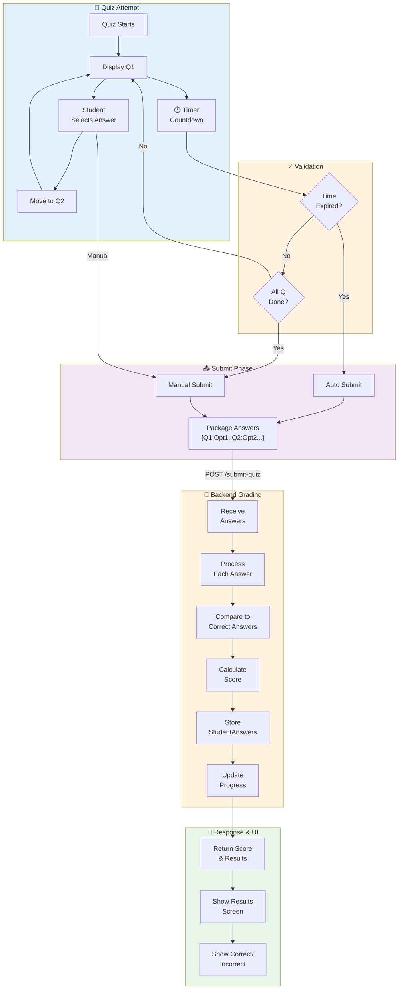
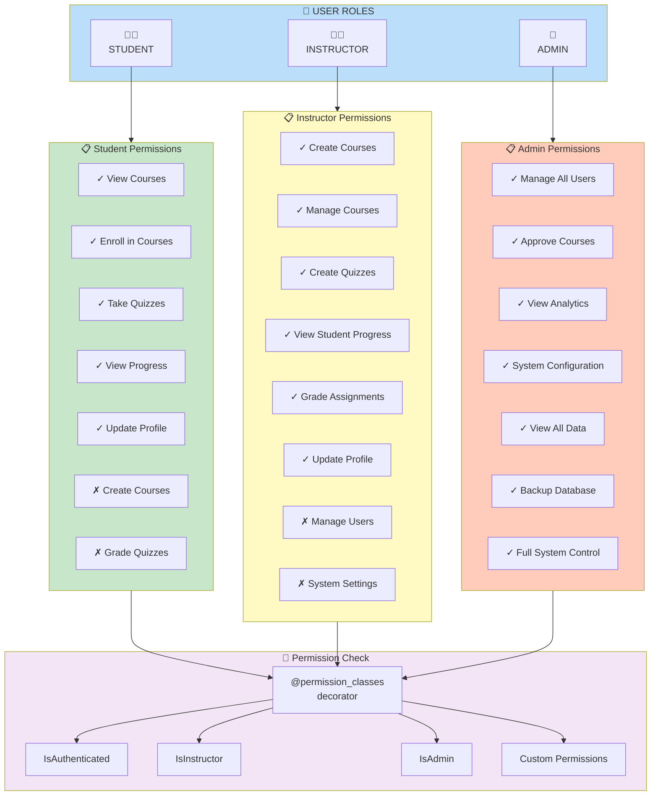
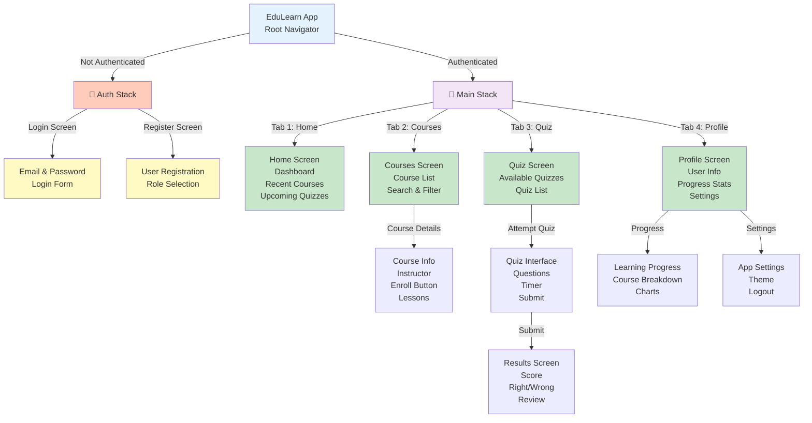
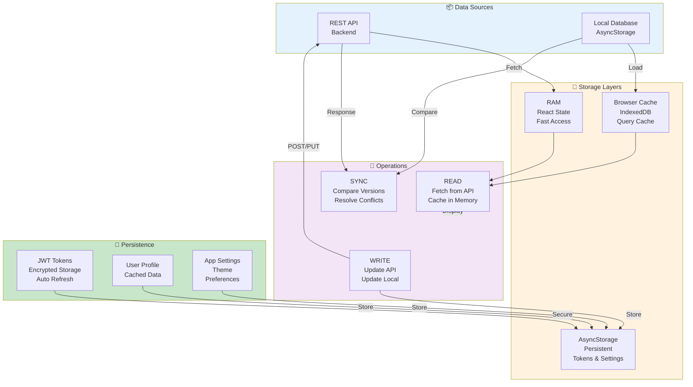
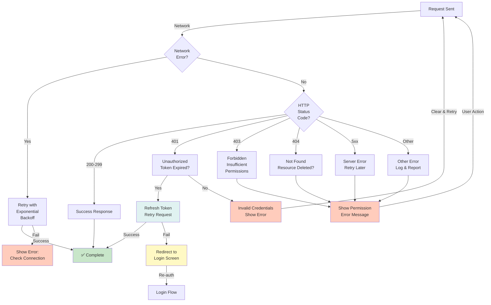

<!--
    EduLearn - Complete Mermaid Diagram Suite
    This file contains all architectural diagrams for the EduLearn LMS Project
    Generated: November 11, 2025
-->

# EduLearn System Architecture Diagrams

## 1. COMPLETE SYSTEM ARCHITECTURE



---

## 2. DETAILED REQUEST-RESPONSE CYCLE



---

## 3. DATABASE SCHEMA - RELATIONSHIP DIAGRAM



---

## 4. AUTHENTICATION & SECURITY FLOW



---

## 5. COURSE ENROLLMENT WORKFLOW



---

## 6. QUIZ SUBMISSION & GRADING



---

## 7. USER ROLES & PERMISSIONS



---

## 8. MOBILE APP SCREEN HIERARCHY



---

## 9. DATA PERSISTENCE STRATEGY



---

## 10. ERROR HANDLING & RECOVERY



---

## 11. SCALABILITY & PERFORMANCE ARCHITECTURE

```mermaid
graph TB
    subgraph Load["📊 Load Distribution"]
        CDN["CDN<br/>Static Assets<br/>Course Media"]
        LB["Load Balancer<br/>Traffic Distribution<br/>SSL Termination"]
    end

    subgraph Servers["🖥️ Application Servers"]
        Server1["Django Server 1"]
        Server2["Django Server 2"]
        Server3["Django Server 3"]
    end

    subgraph Cache["⚡ Caching Layer"]
        Redis["Redis Cache<br/>Session Cache<br/>Query Cache"]
    end

    subgraph DB["💾 Database Layer"]
        Primary["PostgreSQL<br/>Primary Database<br/>Write Operations"]
        Replica["PostgreSQL<br/>Read Replica<br/>Read-Heavy Queries"]
    end

    subgraph Monitoring["📈 Monitoring"]
        Logs["Log Aggregation<br/>Error Tracking"]
        Metrics["Metrics<br/>Performance<br/>Resource Usage"]
    end

    subgraph Backup["🔄 Backup & DR"]
        Backup["Daily Backups<br/>Snapshots"]
        Recovery["Disaster<br/>Recovery Plan"]
    end

    CDN -->|Distribute| LB
    LB -->|Route| Server1
    LB -->|Route| Server2
    LB -->|Route| Server3

    Server1 --> Redis
    Server2 --> Redis
    Server3 --> Redis

    Redis --> Primary
    Server1 -->|Read| Replica
    Server2 -->|Read| Replica
    Server3 -->|Read| Replica

    Server1 --> Logs
    Server2 --> Logs
    Server3 --> Logs

    Server1 --> Metrics
    Primary --> Backup
    Backup --> Recovery

    style Load fill:#bbdefb
    style Servers fill:#fff3e0
    style Cache fill:#e0f2f1
    style DB fill:#e8f5e9
    style Monitoring fill:#f3e5f5
    style Backup fill:#ffccbc
```

---

**Mermaid Diagram Suite Complete**  
_For visual rendering, use a Mermaid viewer or integrate into documentation_
