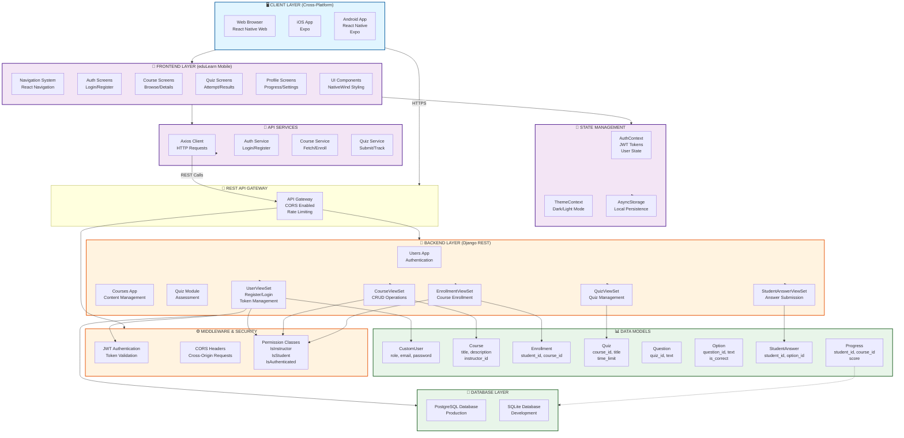
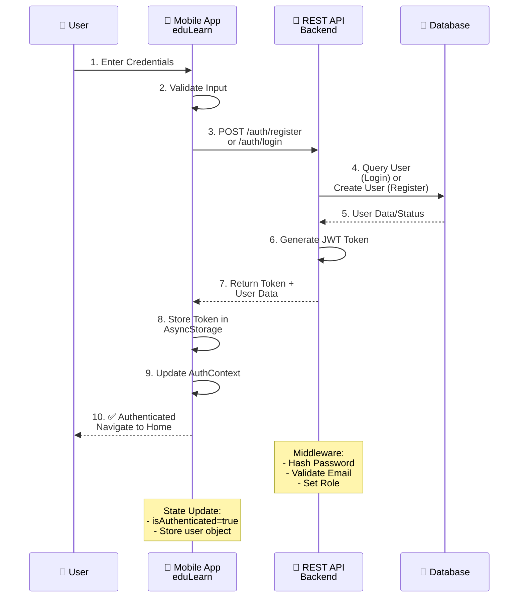
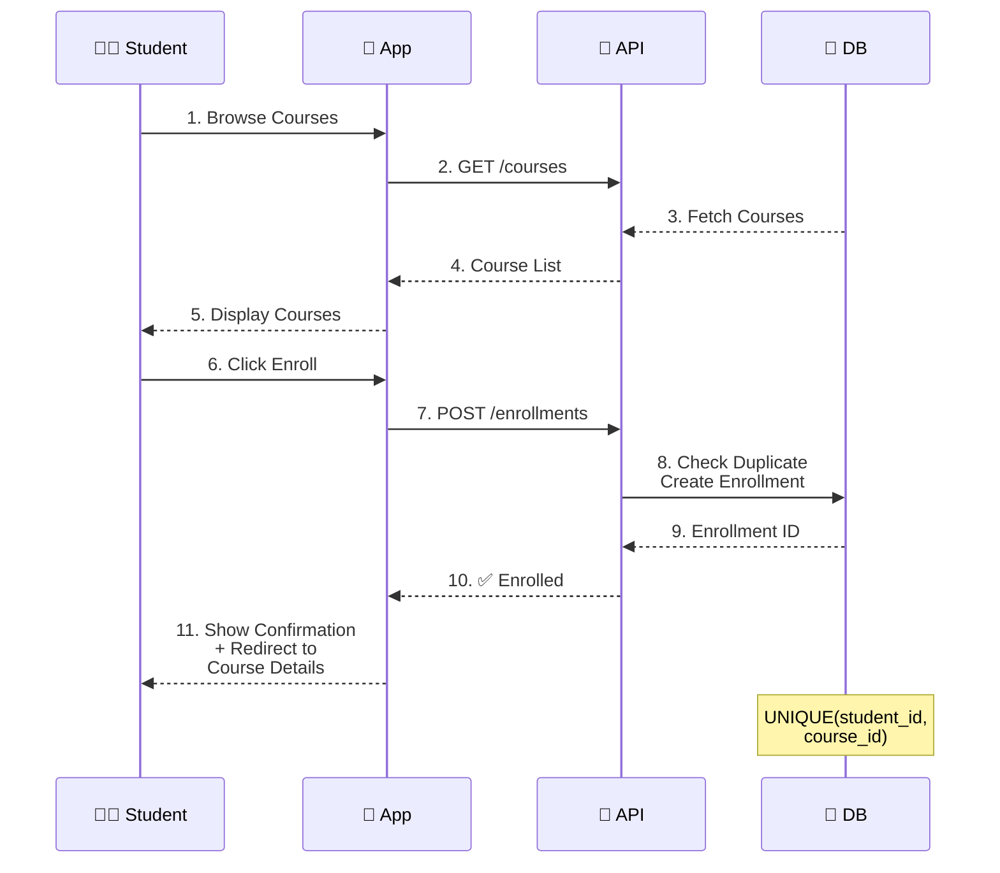
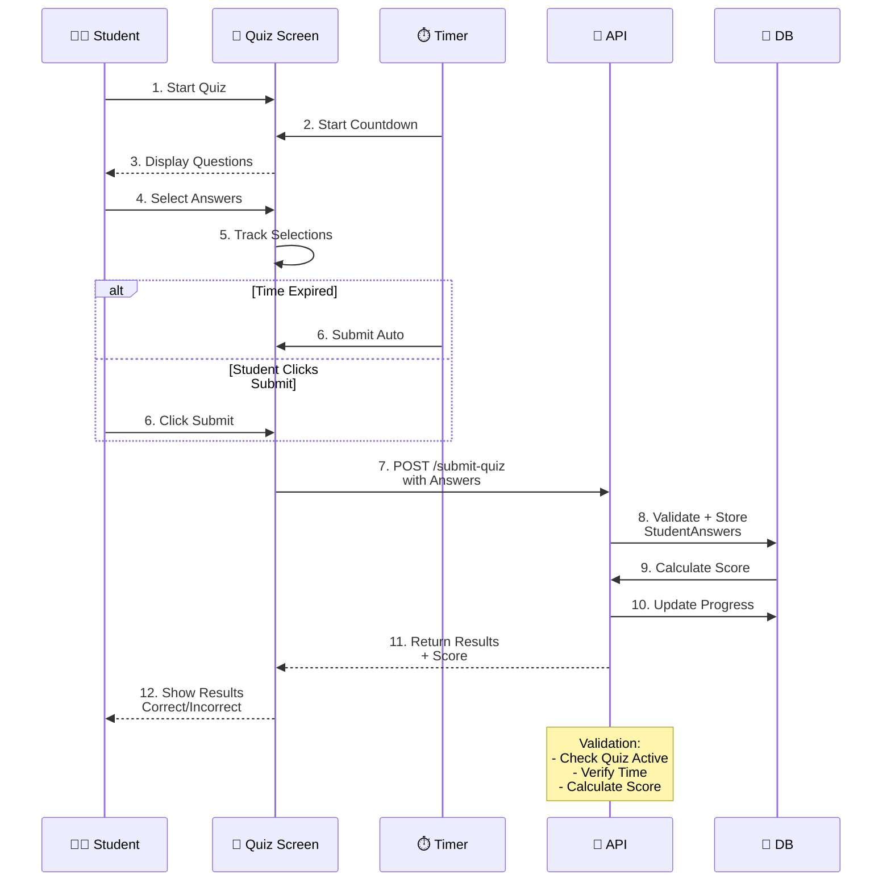
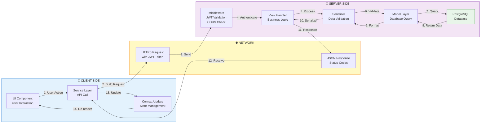
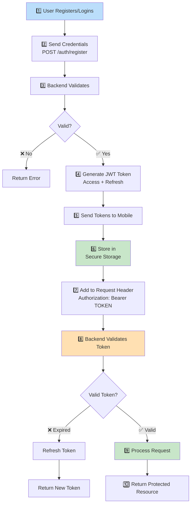
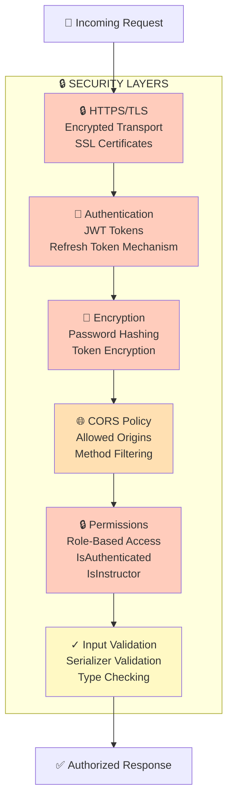
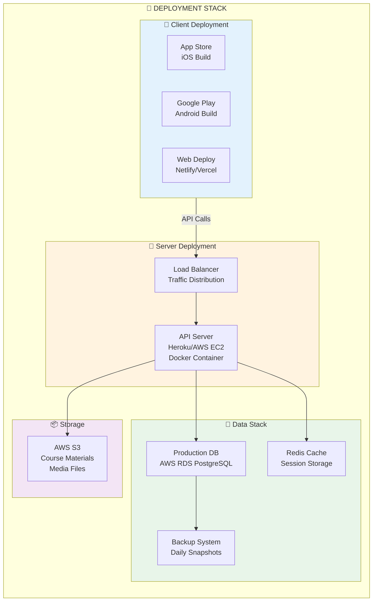
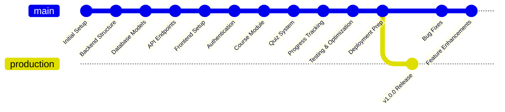

# EduLearn - Comprehensive Project Architecture & Documentation

## 📋 Table of Contents

1. [Project Overview](#project-overview)
2. [Architecture Diagram](#architecture-diagram)
3. [Database Schema (ER Diagram)](#database-schema-er-diagram)
4. [System Workflow](#system-workflow)
5. [Component Breakdown](#component-breakdown)
6. [Technology Stack](#technology-stack)
7. [Data Flow](#data-flow)

---

## 🎯 Project Overview

### **Project Name:** EduLearn - E-Learning Management System

### **Motivation:**

- Create a comprehensive, scalable e-learning platform accessible across multiple devices
- Provide educators with tools to create and manage courses
- Enable students to access learning materials, take quizzes, and track progress
- Implement secure authentication and role-based access control
- Ensure responsive design for web and mobile platforms

### **Purpose:**

EduLearn is a full-stack learning management system (LMS) designed to facilitate online education with:

- Real-time course management
- Quiz-based assessment system
- Progress tracking and analytics
- Multi-platform support (iOS, Android, Web)
- Secure JWT-based authentication

### **Key Roles:**

```
┌─────────────────────────────────────────────────────────┐
│                      USER ROLES                         │
├─────────────────────────────────────────────────────────┤
│ 👨‍🎓 STUDENT                                             │
│  ├─ Browse and search courses                          │
│  ├─ Enroll in courses                                  │
│  ├─ Take quizzes and assessments                       │
│  └─ Track learning progress                            │
├─────────────────────────────────────────────────────────┤
│ 👨‍🏫 INSTRUCTOR                                          │
│  ├─ Create and manage courses                          │
│  ├─ Create quizzes and questions                       │
│  ├─ View student progress                              │
│  └─ Manage course content                              │
├─────────────────────────────────────────────────────────┤
│ 🔧 ADMIN                                               │
│  ├─ Manage all users and roles                         │
│  ├─ System administration                              │
│  └─ View platform analytics                            │
└─────────────────────────────────────────────────────────┘
```

---

## 🏗️ Architecture Diagram



---

## 📊 Database Schema (ER Diagram)

```mermaid
erDiagram
    CUSTOM_USER ||--o{ COURSE : creates
    CUSTOM_USER ||--o{ ENROLLMENT : enrolls
    CUSTOM_USER ||--o{ PROGRESS : tracks
    CUSTOM_USER ||--o{ STUDENT_ANSWER : submits

    COURSE ||--o{ ENROLLMENT : "has"
    COURSE ||--o{ QUIZ : contains
    COURSE ||--o{ PROGRESS : "monitors"

    QUIZ ||--o{ QUESTION : includes

    QUESTION ||--o{ OPTION : "has multiple"
    QUESTION ||--o{ STUDENT_ANSWER : "answered by"

    OPTION ||--o{ STUDENT_ANSWER : "selected in"

    CUSTOM_USER {
        int id
        string username UK "Unique"
        string email UK "Unique"
        string password_hash
        string first_name
        string last_name
        string role FK "student|instructor|admin"
        datetime created_at
        datetime updated_at
        boolean is_active
    }

    COURSE {
        int id PK
        string title
        string description
        int instructor_id FK "References CUSTOM_USER"
        datetime created_at
        datetime updated_at
        text course_content
    }

    ENROLLMENT {
        int id PK
        int student_id FK "References CUSTOM_USER"
        int course_id FK "References COURSE"
        datetime enrolled_at
        unique "student_id, course_id"
    }

    QUIZ {
        int id PK
        int course_id FK "References COURSE"
        string title
        int time_limit "in minutes"
        datetime created_at
    }

    QUESTION {
        int id PK
        int quiz_id FK "References QUIZ"
        string text
        datetime created_at
    }

    OPTION {
        int id PK
        int question_id FK "References QUESTION"
        string text
        boolean is_correct
    }

    STUDENT_ANSWER {
        int id PK
        int student_id FK "References CUSTOM_USER"
        int question_id FK "References QUESTION"
        int selected_option_id FK "References OPTION"
        datetime submitted_at
    }

    PROGRESS {
        int id PK
        int student_id FK "References CUSTOM_USER"
        int course_id FK "References COURSE"
        int completed_lessons
        int total_lessons
        float score
        float progress_percent "Calculated Field"
    }
```

---

## 🔄 System Workflow

### **Authentication Flow**



### **Course Enrollment Flow**



### **Quiz Submission Flow**



---

## 🔧 Component Breakdown

### **Backend Components**

#### **Users Module**

```
Backend/users/
├── models.py
│   └── CustomUser
│       ├── username (Unique)
│       ├── email (Unique)
│       ├── role (student|instructor|admin)
│       └── is_active
├── serializers.py
│   └── RegisterSerializer
├── views.py
│   └── RegisterView
└── urls.py
    └── /register - POST
```

**Responsibilities:**

- User registration and account creation
- Role assignment (student/instructor/admin)
- User profile management
- Authentication token generation

---

#### **Courses Module**

```
Backend/courses/
├── models.py
│   ├── Course
│   │   ├── title
│   │   ├── description
│   │   ├── instructor (FK → CustomUser)
│   │   └── created_at
│   ├── Enrollment
│   │   ├── student (FK → CustomUser)
│   │   ├── course (FK → Course)
│   │   └── unique_together(student, course)
│   ├── Progress
│   │   ├── student (FK → CustomUser)
│   │   ├── course (FK → Course)
│   │   ├── completed_lessons
│   │   ├── total_lessons
│   │   └── score
│   ├── Quiz
│   │   ├── course (FK → Course)
│   │   ├── title
│   │   └── time_limit (minutes)
│   ├── Question
│   │   ├── quiz (FK → Quiz)
│   │   └── text
│   ├── Option
│   │   ├── question (FK → Question)
│   │   ├── text
│   │   └── is_correct
│   └── StudentAnswer
│       ├── student (FK → CustomUser)
│       ├── question (FK → Question)
│       ├── selected_option (FK → Option)
│       └── submitted_at
├── views.py
│   ├── CourseViewSet
│   │   └── CRUD operations
│   ├── EnrollmentViewSet
│   │   └── Course enrollment management
│   ├── QuizViewSet
│   │   └── Quiz management
│   └── StudentAnswerViewSet
│       └── @action submit-quiz
├── serializers.py
│   └── Multiple model serializers
└── permissions.py
    ├── IsInstructorOrReadOnly
    └── Custom permission classes
```

**Responsibilities:**

- Course creation and management
- Student enrollment tracking
- Quiz and question management
- Answer submission and grading
- Progress calculation

---

### **Frontend Components (eduLearn)**

#### **Navigation System**

```
src/navigation/
├── AppNavigator
│   ├── Authentication Stack
│   │   ├── LoginScreen
│   │   └── RegisterScreen
│   └── Main Stack (when authenticated)
│       ├── HomeStack
│       ├── CoursesStack
│       ├── QuizzesStack
│       └── ProfileStack
```

#### **Screens**

```
src/screens/
├── auth/
│   ├── LoginScreen - JWT login interface
│   └── RegisterScreen - User registration
├── courses/
│   ├── CourseListScreen - Browse courses
│   ├── CourseDetailScreen - Course info
│   └── CourseEnrollScreen - Enrollment action
├── quiz/
│   ├── QuizListScreen - Available quizzes
│   ├── QuizAttemptScreen - Quiz interface
│   └── QuizResultScreen - Score display
└── profile/
    ├── ProfileScreen - User info
    ├── ProgressScreen - Learning progress
    └── SettingsScreen - App settings
```

#### **Components**

```
src/components/
├── auth/
│   ├── LoginForm
│   ├── RegisterForm
│   └── AuthGuard
├── course/
│   ├── CourseCard
│   ├── CourseList
│   └── EnrollmentButton
├── quiz/
│   ├── QuestionCard
│   ├── OptionButton
│   ├── QuizTimer
│   └── ResultDisplay
└── common/
    ├── Header
    ├── Loading
    ├── ErrorBoundary
    └── BottomNavigation
```

#### **Context Providers**

```
src/contexts/
├── AuthContext
│   ├── State: user, token, isAuthenticated
│   ├── Methods: login, logout, register
│   └── Persistence: AsyncStorage
└── ThemeContext
    ├── State: theme (light/dark)
    ├── Methods: toggleTheme
    └── Detection: System preference
```

#### **Services**

```
src/services/
├── apiClient.ts
│   └── Axios instance with interceptors
├── authService.ts
│   ├── register()
│   └── login()
├── courseService.ts
│   ├── getCourses()
│   ├── enrollCourse()
│   └── getCourseDetails()
└── quizService.ts
    ├── getQuizzes()
    ├── submitQuiz()
    └── getResults()
```

---

## 💻 Technology Stack

### **Frontend (eduLearn Mobile App)**

| Layer           | Technology             | Purpose                           |
| --------------- | ---------------------- | --------------------------------- |
| **Framework**   | React Native 0.81.5    | Cross-platform mobile development |
| **Runtime**     | Expo 54.0.23           | Development & deployment platform |
| **UI Styling**  | NativeWind 4.2.1       | Tailwind CSS for React Native     |
| **Navigation**  | React Navigation 7.x   | Screen navigation and routing     |
| **HTTP Client** | Axios 1.13.0           | REST API communication            |
| **State Mgmt**  | React Context API      | Global state management           |
| **Storage**     | AsyncStorage 2.2.0     | Persistent local storage          |
| **Security**    | Secure Store 15.0.7    | Encrypted token storage           |
| **Language**    | TypeScript 5.9.2       | Type-safe development             |
| **Styling**     | Tailwind CSS 4.1.16    | Utility-first CSS                 |
| **Gestures**    | Gesture Handler 2.29.0 | Advanced gesture recognition      |

### **Backend (Django REST API)**

| Layer              | Technology            | Purpose                    |
| ------------------ | --------------------- | -------------------------- |
| **Framework**      | Django 5.2.7          | Web framework              |
| **REST API**       | Django REST Framework | RESTful API development    |
| **Authentication** | Simple JWT            | Token-based authentication |
| **CORS**           | Django CORS Headers   | Cross-origin requests      |
| **Database ORM**   | Django ORM            | Object-relational mapping  |
| **Language**       | Python 3.10+          | Backend programming        |
| **Environment**    | python-dotenv         | Configuration management   |

### **Database**

| Environment     | Database       | Purpose                |
| --------------- | -------------- | ---------------------- |
| **Production**  | PostgreSQL 14+ | Scalable relational DB |
| **Development** | SQLite 3       | Lightweight local DB   |

### **Deployment**

| Component    | Platform   | Details               |
| ------------ | ---------- | --------------------- |
| **Mobile**   | Expo Go    | Android & iOS testing |
| **Backend**  | Heroku/AWS | REST API hosting      |
| **Database** | AWS RDS    | Managed PostgreSQL    |
| **Storage**  | S3         | Course media storage  |

---

## 📡 Data Flow

### **Complete Request-Response Cycle**



### **Authentication Token Flow**



---

## 🎯 Key Functionalities

### **Student Features**

| Feature            | Description               | Backend Endpoint                | Frontend Component |
| ------------------ | ------------------------- | ------------------------------- | ------------------ |
| **Browse Courses** | Search and filter courses | GET /courses                    | CourseListScreen   |
| **Enroll Course**  | Join a course             | POST /enrollments               | EnrollmentButton   |
| **View Progress**  | Track learning progress   | GET /progress                   | ProgressScreen     |
| **Take Quiz**      | Attempt course quizzes    | GET /quizzes, POST /submit-quiz | QuizAttemptScreen  |
| **View Results**   | Check quiz scores         | GET /student-answers            | QuizResultScreen   |
| **Update Profile** | Manage account settings   | PUT /user/profile               | ProfileScreen      |

### **Instructor Features**

| Feature            | Description              | Backend Endpoint  | Frontend Component |
| ------------------ | ------------------------ | ----------------- | ------------------ |
| **Create Course**  | Add new courses          | POST /courses     | CourseCreateScreen |
| **Manage Content** | Edit course details      | PUT /courses/{id} | CourseEditScreen   |
| **Create Quiz**    | Build assessments        | POST /quizzes     | QuizBuilderScreen  |
| **View Analytics** | Student progress reports | GET /analytics    | AnalyticsScreen    |

### **Admin Features**

| Feature               | Description            | Backend Endpoint |
| --------------------- | ---------------------- | ---------------- |
| **User Management**   | Manage users and roles | /users, /roles   |
| **Course Approval**   | Approve courses        | /courses/approve |
| **System Monitoring** | View platform metrics  | /admin/metrics   |

---

## 🔐 Security Features



---

## 📈 Scalability & Performance

### **Frontend Optimization**

- **Code Splitting:** Lazy loading screens and components
- **Memoization:** React.memo for performance
- **AsyncStorage:** Efficient local caching
- **HTTP Interceptors:** Request/response optimization

### **Backend Optimization**

- **Pagination:** Limit query results
- **Caching:** Django cache framework
- **Database Indexing:** Optimize frequent queries
- **API Rate Limiting:** Prevent abuse

### **Database Optimization**

- **Indexes:** Primary keys and foreign keys
- **Normalization:** Reduce redundancy
- **Connection Pooling:** Manage connections efficiently
- **Query Optimization:** SELECT specific fields

---

## 🚀 Deployment Architecture



---

## 📊 Project Statistics

| Metric                    | Value                                 |
| ------------------------- | ------------------------------------- |
| **Backend Endpoints**     | 20+ RESTful APIs                      |
| **Database Tables**       | 7 main tables                         |
| **Frontend Screens**      | 15+ screens                           |
| **React Components**      | 30+ components                        |
| **Authentication Method** | JWT with Refresh Tokens               |
| **Supported Platforms**   | iOS, Android, Web                     |
| **Database**              | PostgreSQL (Production), SQLite (Dev) |
| **API Framework**         | Django REST Framework                 |
| **Frontend Framework**    | React Native + Expo                   |

---

## 🔄 Development Workflow



---

## 🎓 Learning Outcomes

### **For Students**

✅ Structured learning paths  
✅ Progress visualization  
✅ Immediate feedback on quizzes  
✅ Multi-device accessibility  
✅ Flexible learning schedule

### **For Instructors**

✅ Easy course management  
✅ Assessment tools  
✅ Student analytics  
✅ Content management  
✅ Progress monitoring

### **For Administrators**

✅ User management  
✅ Platform analytics  
✅ System monitoring  
✅ Quality control  
✅ Scalability management

---

## 📝 Future Enhancements

- [ ] Real-time notifications using WebSocket
- [ ] Video streaming capabilities
- [ ] Discussion forums
- [ ] Peer-to-peer learning
- [ ] AI-powered recommendations
- [ ] Gamification features (badges, leaderboards)
- [ ] Advanced analytics and reporting
- [ ] Mobile payment integration
- [ ] Offline mode for downloaded content
- [ ] Integration with third-party LMS platforms

---

**Document Version:** 1.0  
**Last Updated:** November 11, 2025  
**Author:** Project Documentation  
**Status:** 📋 Active Development
