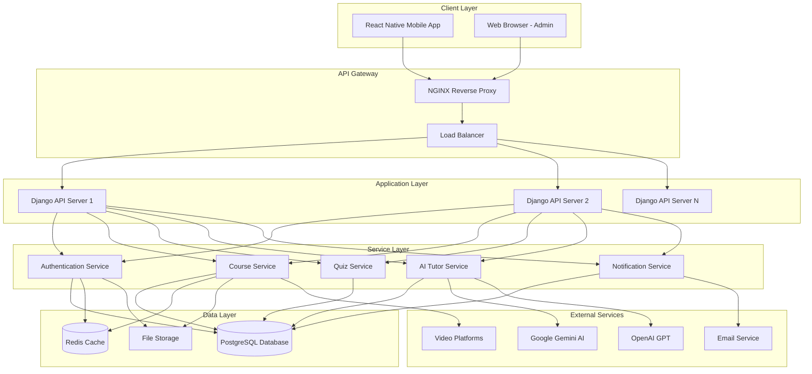
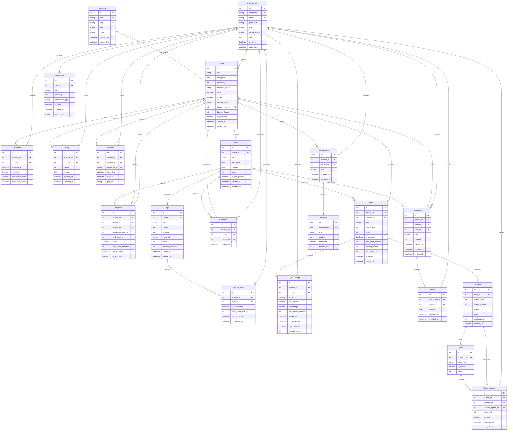
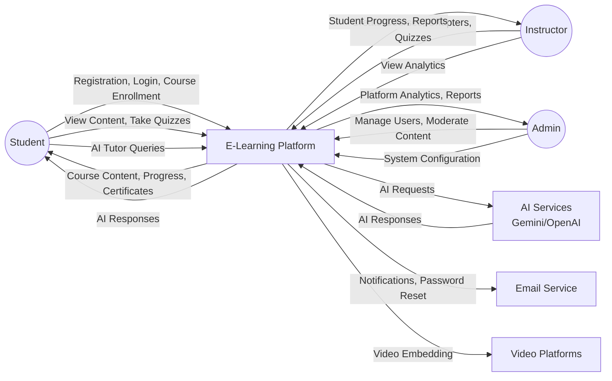
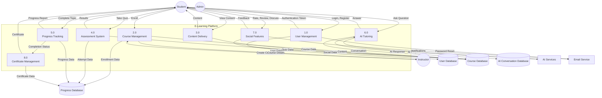
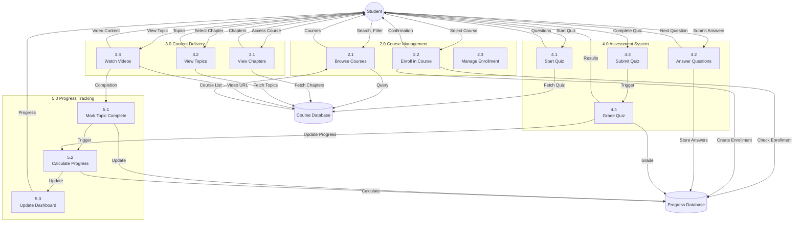
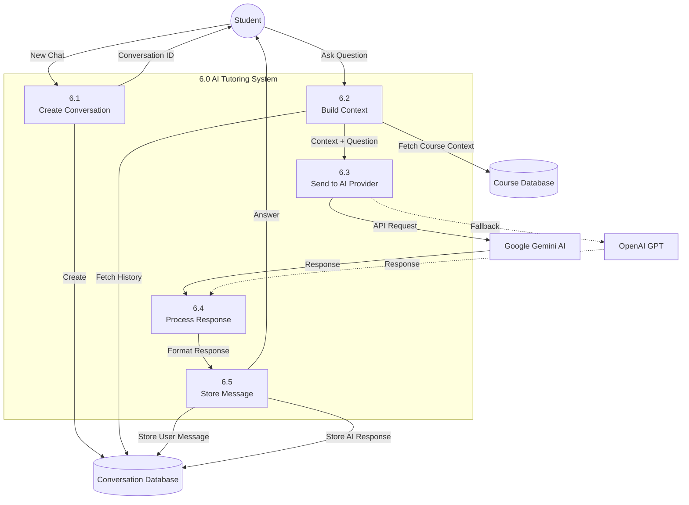
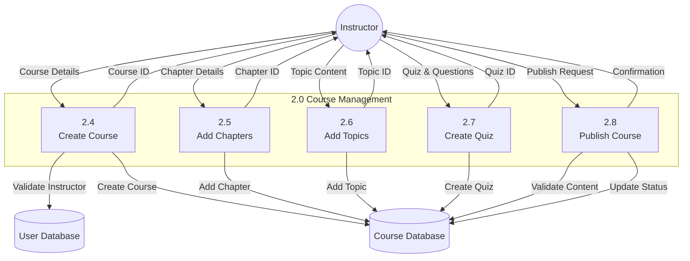

# E-Learning Platform - Capstone Project Report

**Project Name:** EduLearn - AI-Powered Learning Management System  
**Academic Year:** 2024-2025  
**Technology Stack:** Django REST Framework, React Native, PostgreSQL, AI Integration (Gemini & OpenAI)

---

## Table of Contents

1. [Introduction](#1-introduction)
   - 1.1 [Objective of the Project](#11-objective-of-the-project)
   - 1.2 [Description of the Project](#12-description-of-the-project)
   - 1.3 [Scope of the Project](#13-scope-of-the-project)
   - 1.3.1 [Use Case Model](#131-use-case-model)

2. [System Description](#2-system-description)
   - 2.1 [Customer/User Profiles](#21-customeruser-profiles)
   - 2.2 [Assumptions and Dependencies](#22-assumptions-and-dependencies)
   - 2.3 [Functional Requirements](#23-functional-requirements)
   - 2.4 [Non-Functional Requirements](#24-non-functional-requirements)

3. [Design](#3-design)
   - 3.1 [System Design](#31-system-design)
   - 3.1.1 [E-R Diagram](#311-e-r-diagram)
   - 3.1.2 [Data Flow Diagrams (DFD)](#312-data-flow-diagrams-dfd)
   - 3.2 [Database Design](#32-database-design)

4. [Scheduling and Estimates](#4-scheduling-and-estimates)

5. [Technical Implementation](#5-technical-implementation)

6. [Screenshots and Demonstrations](#6-screenshots-and-demonstrations)

7. [Future Scope](#7-future-scope)

8. [Conclusion](#8-conclusion)

---

## 1. Introduction

### 1.1 Objective of the Project

The primary objective of this E-Learning Platform (EduLearn) is to develop a comprehensive, full-stack educational technology solution that revolutionizes online learning through:


**Core Objectives:**

1. **Democratizing Education**: Providing accessible, high-quality educational content to learners worldwide through an intuitive mobile-first platform

2. **Empowering Educators**: Enabling instructors to create, manage, and deliver structured educational content with powerful course management tools

3. **Personalizing Learning**: Implementing AI-powered tutoring capabilities using Google Gemini and OpenAI to provide personalized, context-aware learning assistance

4. **Tracking Progress**: Offering comprehensive progress tracking and analytics to help students monitor their learning journey

5. **Ensuring Quality**: Implementing robust assessment systems with automated grading, multiple quiz types, and detailed feedback mechanisms

6. **Building Community**: Fostering engagement through discussion forums, ratings, reviews, and social learning features

7. **Delivering Value**: Supporting multiple user roles (Students, Instructors, Administrators) with role-based access control

8. **Scaling Effectively**: Creating a scalable, secure, and performant solution using modern web technologies

**Key Success Metrics:**
- Support for 1000+ concurrent users
- API response time < 2 seconds for 95% of requests
- 99.5% system uptime
- Comprehensive course lifecycle management
- AI-powered tutoring with multi-provider support

---

### 1.2 Description of the Project

The E-Learning Platform is a modern, full-stack educational technology solution designed to facilitate seamless online learning experiences. The platform consists of two tightly integrated components:


#### **Backend System - Django REST Framework**

A robust, scalable RESTful API architecture built with enterprise-grade technologies:

**Core Technologies:**
- **Framework**: Django 5.2.7 with Django REST Framework 3.16.1
- **Database**: PostgreSQL (production-grade relational database)
- **Authentication**: JWT-based authentication with automatic token refresh (djangorestframework-simplejwt 5.5.1)
- **AI Integration**: Dual-provider support (Google Gemini AI & OpenAI GPT)
- **File Management**: Media handling for course thumbnails and profile images using Pillow 9.3.0
- **Rate Limiting**: django-ratelimit 4.1.0 for API protection

**Key Features:**
- **100+ RESTful API Endpoints**: Comprehensive API coverage for all platform features
- **16 Database Models**: Complex relational data structure with proper normalization
- **20+ ViewSets**: Django REST Framework ViewSets with custom actions
- **Multi-Role Support**: Student, Instructor, and Administrator roles with granular permissions
- **Course Management**: Complete CRUD operations with categories, difficulty levels, and publishing workflow
- **Content Delivery**: Hierarchical structure (Course → Chapter → Topic) with rich text, code examples, and video integration
- **Assessment System**: Multiple quiz types (MCQ, True/False, Short Answer) with automatic grading
- **Progress Tracking**: Real-time tracking at topic, chapter, and course levels with time analytics
- **AI Tutoring**: Context-aware AI assistance with conversation history and rate limiting
- **Social Features**: Discussion forums, ratings, reviews, bookmarks, and notifications
- **Certificate System**: Automated certificate generation with unique IDs and verification


#### **Frontend Application - React Native with Expo**

A cross-platform mobile application delivering exceptional user experience:

**Core Technologies:**
- **Framework**: React Native 0.81.5 with Expo SDK 54
- **Language**: TypeScript 5.9.2 for type-safe development
- **State Management**: React Context API (AuthContext, ThemeContext)
- **Navigation**: React Navigation 7.x with Stack and Bottom Tab navigators
- **HTTP Client**: Axios 1.13.2 with request/response interceptors
- **Secure Storage**: Expo SecureStore for JWT tokens, AsyncStorage for preferences
- **UI Components**: Custom component library with Lucide React Native icons

**Key Features:**
- **Seamless Authentication**: JWT-based auth with automatic token refresh and secure storage
- **Intuitive Navigation**: Bottom tab navigation for main sections, stack navigation for deep linking
- **Course Discovery**: Browse courses by category, difficulty, search with filters
- **Rich Content Viewing**: Chapter-based learning with topics, video lectures, and code examples
- **Interactive Assessments**: Quiz interface with timer, multiple question types, and instant feedback
- **Progress Visualization**: Real-time progress bars, completion percentages, and learning streaks
- **AI Tutor Chat**: Conversational AI interface with message history and context awareness
- **Theme Support**: Dark/Light mode with system preference detection
- **Offline Capability**: Local caching for course data and offline viewing
- **Accessibility**: WCAG 2.1 compliant with screen reader support


**Platform Architecture:**

```
┌─────────────────────────────────────────────────────────────┐
│                    Mobile Application                       │
│                  (React Native + Expo)                      │
│  ┌──────────────────────────────────────────────────────┐   │
│  │  Presentation Layer (Screens & Components)           │   │
│  └────────────────────┬─────────────────────────────────┘   │
│                       │                                     │
│  ┌────────────────────▼─────────────────────────────────┐   │
│  │  Business Logic Layer (Services & Contexts)          │   │
│  └────────────────────┬─────────────────────────────────┘   │
│                       │                                     │
│  ┌────────────────────▼─────────────────────────────────┐   │
│  │  Data Layer (API Client + Secure Storage)            │   │
│  └────────────────────┬─────────────────────────────────┘   │
└───────────────────────┼─────────────────────────────────────┘
                        │ HTTPS/TLS
                        │ JWT Authentication
                        │
┌───────────────────────▼─────────────────────────────────────┐
│                    Backend API Server                       │
│                  (Django REST Framework)                    │
│  ┌──────────────────────────────────────────────────────┐   │
│  │  API Layer (ViewSets, Serializers, Permissions)      │   │
│  └────────────────────┬─────────────────────────────────┘   │
│                       │                                     │
│  ┌────────────────────▼─────────────────────────────────┐   │
│  │  Business Logic Layer (Models, Services)             │   │
│  └────────────────────┬─────────────────────────────────┘   │
│                       │                                     │
│  ┌────────────────────▼─────────────────────────────────┐   │
│  │  Data Access Layer (ORM, Database)                   │   │
│  └────────────────────┬─────────────────────────────────┘   │
└───────────────────────┼─────────────────────────────────────┘
                        │
                        ▼
              ┌──────────────────┐
              │   PostgreSQL     │
              │    Database      │
              └──────────────────┘
```

---

### 1.3 Scope of the Project

The E-Learning Platform encompasses a comprehensive set of features organized into functional modules:


**Functional Modules:**

1. **User Management Module**
   - Multi-role system (Student, Instructor, Administrator)
   - JWT-based authentication with token refresh
   - Profile management with images and bio
   - Password reset and recovery
   - Role-based access control (RBAC)

2. **Course Management Module**
   - Complete CRUD operations for courses
   - Category system with icons and colors
   - Difficulty levels (Beginner, Intermediate, Advanced)
   - Publishing workflow (Draft/Published)
   - Pricing support (Free/Paid)
   - Thumbnail management
   - Advanced search and filtering

3. **Content Delivery Module**
   - Hierarchical structure (Course → Chapter → Topic)
   - Rich text content with markdown support
   - Code examples with syntax highlighting
   - Video integration (YouTube, Vimeo)
   - Sequential progression
   - Free preview chapters
   - Duration tracking

4. **Assessment System Module**
   - Multiple question types (MCQ, True/False, Short Answer)
   - Quiz configuration (time limits, passing scores, max attempts)
   - Automatic grading
   - Detailed feedback and explanations
   - Attempt tracking
   - Score analytics

5. **Progress Tracking Module**
   - Topic-level completion status
   - Chapter-level progress percentage
   - Course-level overall progress
   - Time analytics
   - Learning streaks
   - Continue learning feature

6. **AI Tutoring Module**
   - Context-aware AI assistance
   - Multi-provider support (Gemini, OpenAI)
   - Conversation management
   - Course-specific tutoring
   - Rate limiting (60 requests/minute)
   - Message history

7. **Social & Interactive Features Module**
   - Discussion forums (course and chapter level)
   - Rating & review system (1-5 stars)
   - Bookmark functionality
   - Notification system
   - Threaded replies

8. **Certificate Management Module**
   - Automatic generation upon completion
   - Unique certificate IDs (UUID)
   - Verification system
   - PDF generation
   - Validity tracking

9. **Dashboard & Analytics Module**
   - Student dashboard (enrolled courses, progress)
   - Instructor dashboard (course performance, student stats)
   - Admin dashboard (platform-wide statistics)
   - Recent activity feeds
   - Achievement showcase

10. **Administrative Features Module**
    - User management (CRUD operations)
    - Content moderation
    - Category management
    - System configuration
    - Analytics & reporting
    - Audit logs


### 1.3.1 Use Case Model

The following use case diagram illustrates the interactions between different actors and the E-Learning Platform:

```mermaid
graph TB
    subgraph "E-Learning Platform Use Cases"
        subgraph "Student Use Cases"
            UC1[UC-1: Register/Login]
            UC2[UC-2: Browse Courses]
            UC3[UC-3: Enroll in Course]
            UC4[UC-4: View Course Content]
            UC5[UC-5: Complete Topics]
            UC6[UC-6: Take Quizzes]
            UC7[UC-7: Track Progress]
            UC8[UC-8: Use AI Tutor]
            UC9[UC-9: Participate in Discussions]
            UC10[UC-10: Rate & Review Courses]
            UC11[UC-11: Bookmark Content]
            UC12[UC-12: Receive Certificates]
        end
        
        subgraph "Instructor Use Cases"
            UC13[UC-13: Create/Manage Courses]
            UC14[UC-14: Create Chapters & Topics]
            UC15[UC-15: Create Quizzes & Questions]
            UC16[UC-16: View Student Progress]
            UC17[UC-17: Manage Enrollments]
            UC18[UC-18: View Analytics Dashboard]
        end
        
        subgraph "Admin Use Cases"
            UC19[UC-19: Manage All Users]
            UC20[UC-20: Moderate Content]
            UC21[UC-21: View Platform Analytics]
            UC22[UC-22: Manage Categories]
            UC23[UC-23: System Configuration]
            UC24[UC-24: Generate Reports]
        end
    end
    
    Student((Student))
    Instructor((Instructor))
    Admin((Admin))
    
    Student --> UC1
    Student --> UC2
    Student --> UC3
    Student --> UC4
    Student --> UC5
    Student --> UC6
    Student --> UC7
    Student --> UC8
    Student --> UC9
    Student --> UC10
    Student --> UC11
    Student --> UC12
    
    Instructor --> UC1
    Instructor --> UC9
    Instructor --> UC13
    Instructor --> UC14
    Instructor --> UC15
    Instructor --> UC16
    Instructor --> UC17
    Instructor --> UC18
    
    Admin --> UC19
    Admin --> UC20
    Admin --> UC21
    Admin --> UC22
    Admin --> UC23
    Admin --> UC24
    
    UC8 -.-> GeminiAI[Google Gemini AI]
    UC8 -.-> OpenAI[OpenAI GPT]
```



**Key Use Cases:**

**Student Use Cases:**
- **UC-1**: Register/Login - Secure authentication with JWT tokens
- **UC-2**: Browse Courses - Search and filter courses by category, difficulty
- **UC-3**: Enroll in Course - One-click enrollment in published courses
- **UC-4**: View Course Content - Access chapters, topics, videos, code examples
- **UC-5**: Complete Topics - Mark topics as completed, track time spent
- **UC-6**: Take Quizzes - Attempt quizzes with timer, get instant feedback
- **UC-7**: Track Progress - View progress percentage, completion status
- **UC-8**: Use AI Tutor - Ask questions, get context-aware AI responses
- **UC-9**: Participate in Discussions - Create threads, reply to discussions
- **UC-10**: Rate & Review Courses - Submit ratings (1-5 stars) and reviews
- **UC-11**: Bookmark Content - Save courses and chapters for quick access
- **UC-12**: Receive Certificates - Get certificates upon course completion

**Instructor Use Cases:**
- **UC-13**: Create/Manage Courses - CRUD operations on courses
- **UC-14**: Create Chapters & Topics - Structure course content hierarchically
- **UC-15**: Create Quizzes & Questions - Design assessments with various question types
- **UC-16**: View Student Progress - Monitor individual student performance
- **UC-17**: Manage Enrollments - View and manage enrolled students
- **UC-18**: View Analytics Dashboard - Access course performance metrics

**Admin Use Cases:**
- **UC-19**: Manage All Users - CRUD operations on user accounts
- **UC-20**: Moderate Content - Review and approve/reject course content
- **UC-21**: View Platform Analytics - Access platform-wide statistics
- **UC-22**: Manage Categories - Create and manage course categories
- **UC-23**: System Configuration - Configure platform settings
- **UC-24**: Generate Reports - Create comprehensive reports

---


## 2. System Description

### 2.1 Customer/User Profiles

#### **Student Profile**
- **Primary Users**: Learners seeking online education and skill development
- **Age Group**: 16-60 years (diverse age range)
- **Technical Proficiency**: Basic to intermediate computer/mobile skills
- **Educational Background**: High school to postgraduate level
- **Key Needs**:
  - Easy course discovery with intuitive search and filtering
  - Clear, structured learning paths with progress tracking
  - Interactive assessments with immediate feedback
  - AI-powered learning assistance for personalized help
  - Mobile-first experience for learning on-the-go
  - Certificates upon completion for career advancement
  - Community features for peer interaction
  - Flexible learning schedule (self-paced)
- **Usage Pattern**: 
  - Frequency: 3-5 times per week
  - Session Duration: 30-60 minutes per session
  - Peak Usage: Evenings and weekends
  - Device Preference: Mobile (70%), Tablet (20%), Desktop (10%)
- **Pain Points Addressed**:
  - Difficulty finding quality educational content
  - Lack of personalized learning support
  - No clear progress tracking
  - Limited interaction with instructors
  - Expensive traditional education

#### **Instructor Profile**
- **Primary Users**: Educators, subject matter experts, and content creators
- **Age Group**: 25-65 years
- **Technical Proficiency**: Intermediate to advanced
- **Professional Background**: Teachers, industry professionals, trainers
- **Key Needs**:
  - Intuitive course creation and management tools
  - Structured content organization (chapters, topics, quizzes)
  - Student progress monitoring and analytics
  - Quiz creation with various question types
  - Communication tools (discussions, announcements)
  - Performance metrics and insights
  - Revenue tracking (for paid courses)
  - Content versioning and updates
- **Usage Pattern**:
  - Frequency: Daily for active instructors
  - Session Duration: 1-3 hours for content creation
  - Peak Usage: Weekdays during business hours
  - Device Preference: Desktop (60%), Laptop (30%), Mobile (10%)
- **Pain Points Addressed**:
  - Complex course management systems
  - Limited student engagement insights
  - Difficulty creating interactive assessments
  - No centralized platform for content delivery
  - Limited monetization options

#### **Administrator Profile**
- **Primary Users**: Platform managers, moderators, and system administrators
- **Age Group**: 25-50 years
- **Technical Proficiency**: Advanced
- **Professional Background**: IT professionals, education administrators
- **Key Needs**:
  - Comprehensive platform oversight and monitoring
  - User management capabilities (CRUD operations)
  - Content moderation tools and workflows
  - Analytics and reporting dashboards
  - System configuration and maintenance
  - Security and access control management
  - Performance monitoring and optimization
  - Audit logs and compliance tracking
- **Usage Pattern**:
  - Frequency: Daily for platform management
  - Session Duration: 2-4 hours per day
  - Peak Usage: Business hours
  - Device Preference: Desktop (80%), Laptop (20%)
- **Pain Points Addressed**:
  - Lack of centralized management tools
  - Difficulty monitoring platform health
  - Complex user management
  - Limited reporting capabilities
  - Manual content moderation

---


### 2.2 Assumptions and Dependencies

#### **Assumptions**

**Technical Assumptions:**
1. Users have access to smartphones or tablets with internet connectivity (3G/4G/WiFi)
2. Users possess basic digital literacy skills (can navigate mobile apps)
3. Mobile devices run iOS 13+ or Android 8+ operating systems
4. Users have stable internet connection for video streaming (minimum 2 Mbps)
5. Users accept terms of service and privacy policy before registration

**Business Assumptions:**
1. Instructors have expertise in their subject domains and can create quality content
2. Course content is provided primarily in English (with future multi-language support)
3. Students are motivated to complete courses and engage with content
4. Market demand exists for online learning in targeted subject areas
5. Instructors are willing to share revenue (for paid courses)
6. Users trust AI-powered tutoring for learning assistance

**Operational Assumptions:**
1. Platform will have dedicated support team for user queries
2. Content moderation will be performed within 24-48 hours
3. System maintenance windows will be scheduled during low-traffic periods
4. Regular backups will be performed to prevent data loss
5. Security updates will be applied promptly

#### **Dependencies**

**External Services:**
1. **AI Services**:
   - Google Gemini API for AI tutoring (primary provider)
   - OpenAI API as alternative AI provider (fallback)
   - API keys and quota management
   - Service availability and uptime

2. **Database Services**:
   - PostgreSQL database server (version 13+)
   - Database hosting and management
   - Regular backups and disaster recovery

3. **Cloud Storage** (Future):
   - AWS S3 or similar for media file storage
   - CDN for content delivery
   - Image optimization services

4. **Email Services**:
   - SMTP server for transactional emails
   - Email templates and delivery tracking
   - Notification delivery system

5. **Video Platforms**:
   - YouTube for video hosting
   - Vimeo or other video platforms
   - Video embedding and playback

6. **Payment Gateway** (Future):
   - Stripe or PayPal integration
   - PCI compliance requirements
   - Transaction processing

**Technical Dependencies:**
1. **Backend Framework**:
   - Python 3.8+ runtime environment
   - Django 5.2.7 framework
   - Django REST Framework 3.16.1
   - PostgreSQL database driver (psycopg2-binary 2.9.11)

2. **Frontend Framework**:
   - Node.js 16+ for development
   - React Native 0.81.5
   - Expo SDK 54
   - TypeScript 5.9.2

3. **Third-Party Libraries**:
   - JWT authentication (djangorestframework-simplejwt 5.5.1)
   - Image processing (Pillow 9.3.0)
   - HTTP client (Axios 1.13.2)
   - Navigation (React Navigation 7.x)
   - Secure storage (Expo SecureStore)
   - AI SDKs (google-generativeai 0.8.5, openai 2.6.1)

**Infrastructure Dependencies:**
1. **Web Server**:
   - Development: Django development server
   - Production: Gunicorn or uWSGI with Nginx

2. **Application Server**:
   - WSGI server for Django application
   - Process management (Supervisor or systemd)

3. **SSL/TLS**:
   - SSL certificates for HTTPS
   - Certificate renewal automation

4. **Monitoring & Logging**:
   - Application logging framework
   - Error tracking (Sentry or similar)
   - Performance monitoring

**Development Dependencies:**
1. Version control (Git)
2. Package managers (pip, npm)
3. Development tools (VS Code, PyCharm)
4. Testing frameworks (Jest, pytest)
5. CI/CD pipeline (GitHub Actions, Jenkins)

---


### 2.3 Functional Requirements

#### **FR1: User Authentication and Authorization**
- **FR1.1**: The system SHALL support user registration with username, email, password, and role selection
- **FR1.2**: The system SHALL authenticate users using JWT (JSON Web Tokens) with access and refresh tokens
- **FR1.3**: The system SHALL implement role-based access control (RBAC) for Student, Instructor, and Admin roles
- **FR1.4**: The system SHALL provide password reset functionality via email verification
- **FR1.5**: The system SHALL maintain secure session management with automatic token refresh
- **FR1.6**: The system SHALL enforce password complexity requirements (minimum 8 characters, alphanumeric)
- **FR1.7**: The system SHALL log out users after 60 minutes of inactivity
- **FR1.8**: The system SHALL prevent concurrent sessions from the same account (optional)

#### **FR2: Course Management**
- **FR2.1**: Instructors SHALL create courses with title, description, thumbnail, category, and difficulty level
- **FR2.2**: The system SHALL support course categorization with predefined categories
- **FR2.3**: Instructors SHALL publish/unpublish courses to control visibility
- **FR2.4**: The system SHALL display course listings with search functionality by title and description
- **FR2.5**: The system SHALL filter courses by category, difficulty level, and price
- **FR2.6**: The system SHALL track course enrollment counts and display them to instructors
- **FR2.7**: The system SHALL calculate and display average course ratings
- **FR2.8**: Instructors SHALL edit course details at any time
- **FR2.9**: Instructors SHALL delete courses with no active enrollments
- **FR2.10**: The system SHALL support both free and paid courses

#### **FR3: Content Management**
- **FR3.1**: Instructors SHALL create chapters within courses with sequential ordering
- **FR3.2**: Instructors SHALL create topics within chapters with content, examples, and video URLs
- **FR3.3**: The system SHALL support rich text formatting for topic content
- **FR3.4**: Instructors SHALL mark chapters as "free preview" for non-enrolled students
- **FR3.5**: The system SHALL maintain content versioning with creation and update timestamps
- **FR3.6**: Instructors SHALL reorder chapters and topics using drag-and-drop or order numbers
- **FR3.7**: The system SHALL validate video URLs before saving
- **FR3.8**: The system SHALL estimate and display total course duration based on topic durations

#### **FR4: Assessment System**
- **FR4.1**: Instructors SHALL create quizzes with configurable parameters (time limit, passing score, max attempts)
- **FR4.2**: The system SHALL support multiple question types: Multiple Choice, True/False, and Short Answer
- **FR4.3**: The system SHALL automatically grade Multiple Choice and True/False questions
- **FR4.4**: The system SHALL track quiz attempts and enforce maximum attempt limits
- **FR4.5**: The system SHALL provide detailed feedback and explanations for each question
- **FR4.6**: The system SHALL calculate and display quiz scores as percentage and points
- **FR4.7**: The system SHALL implement quiz timer with automatic submission when time expires
- **FR4.8**: Students SHALL view quiz history with all previous attempts
- **FR4.9**: The system SHALL prevent quiz retakes if maximum attempts are reached
- **FR4.10**: Instructors SHALL mark quizzes as required or optional

#### **FR5: Enrollment and Progress Tracking**
- **FR5.1**: Students SHALL enroll in published courses with one-click enrollment
- **FR5.2**: The system SHALL track topic completion status for each student
- **FR5.3**: The system SHALL calculate course progress percentage based on completed topics
- **FR5.4**: The system SHALL record time spent on each topic and course
- **FR5.5**: The system SHALL identify and display "continue learning" courses on student dashboard
- **FR5.6**: The system SHALL mark courses as completed when all required topics and quizzes are finished
- **FR5.7**: Students SHALL unenroll from courses before completion
- **FR5.8**: The system SHALL prevent duplicate enrollments in the same course

#### **FR6: AI Tutoring**
- **FR6.1**: The system SHALL provide AI-powered tutoring assistance using Google Gemini or OpenAI
- **FR6.2**: The system SHALL maintain conversation history per student with persistent storage
- **FR6.3**: The system SHALL provide context-aware responses based on enrolled course content
- **FR6.4**: The system SHALL support multiple AI providers with automatic fallback
- **FR6.5**: The system SHALL implement rate limiting (60 requests per minute per user)
- **FR6.6**: The system SHALL handle AI service failures gracefully with user-friendly error messages
- **FR6.7**: The system SHALL track token usage for cost monitoring
- **FR6.8**: Students SHALL create multiple conversation threads per course
- **FR6.9**: The system SHALL limit message length to 2000 characters
- **FR6.10**: The system SHALL include last 10 messages as context for AI responses

#### **FR7: Social and Interactive Features**
- **FR7.1**: Students SHALL create discussion threads for courses and chapters
- **FR7.2**: Users SHALL reply to discussion threads with nested replies
- **FR7.3**: Instructors SHALL pin important discussions to the top
- **FR7.4**: Students SHALL rate courses on a 1-5 star scale after completion
- **FR7.5**: Students SHALL write and edit text reviews for courses
- **FR7.6**: The system SHALL calculate and display average course ratings
- **FR7.7**: Students SHALL bookmark courses and chapters for quick access
- **FR7.8**: The system SHALL send notifications for course updates, quiz results, and achievements
- **FR7.9**: Users SHALL mark notifications as read
- **FR7.10**: The system SHALL display unread notification count

#### **FR8: Certificate Management**
- **FR8.1**: The system SHALL automatically generate certificates upon course completion
- **FR8.2**: The system SHALL assign unique UUID-based certificate IDs
- **FR8.3**: The system SHALL provide public certificate verification by certificate ID
- **FR8.4**: The system SHALL generate downloadable PDF certificates
- **FR8.5**: The system SHALL store certificate metadata (student, course, issue date)
- **FR8.6**: Administrators SHALL revoke certificates if needed
- **FR8.7**: Students SHALL view all earned certificates in their profile

#### **FR9: Dashboard and Analytics**
- **FR9.1**: Students SHALL view personalized dashboard with enrolled courses and progress
- **FR9.2**: Instructors SHALL view analytics on course performance and student engagement
- **FR9.3**: Admins SHALL access platform-wide statistics and metrics
- **FR9.4**: The system SHALL display popular courses based on enrollment and ratings
- **FR9.5**: The system SHALL provide recent activity feeds for all user roles
- **FR9.6**: Instructors SHALL view individual student progress for their courses
- **FR9.7**: The system SHALL generate revenue reports for instructors (paid courses)
- **FR9.8**: Admins SHALL view user growth metrics and trends

#### **FR10: Profile Management**
- **FR10.1**: Users SHALL update profile information (bio, email, username)
- **FR10.2**: Users SHALL upload and change profile images
- **FR10.3**: Users SHALL change passwords with current password verification
- **FR10.4**: The system SHALL display user statistics (courses enrolled, completed, certificates)
- **FR10.5**: Instructors SHALL view their teaching statistics (courses created, students taught)

---


### 2.4 Non-Functional Requirements

#### **NFR1: Performance**
- **NFR1.1**: API response time SHALL NOT exceed 2 seconds for 95% of requests under normal load
- **NFR1.2**: The system SHALL support concurrent access by 1000+ users without degradation
- **NFR1.3**: Database queries SHALL be optimized with proper indexing on frequently accessed fields
- **NFR1.4**: Mobile app SHALL load initial screen within 3 seconds on 4G connection
- **NFR1.5**: Video content SHALL stream without buffering on 4G connections (minimum 2 Mbps)
- **NFR1.6**: The system SHALL implement pagination for lists exceeding 20 items
- **NFR1.7**: Image thumbnails SHALL be optimized to reduce load time (max 200KB per image)
- **NFR1.8**: The system SHALL cache frequently accessed data to reduce database load

#### **NFR2: Security**
- **NFR2.1**: All API communications SHALL use HTTPS/TLS 1.2+ encryption
- **NFR2.2**: Passwords SHALL be hashed using bcrypt or PBKDF2 with salt
- **NFR2.3**: JWT access tokens SHALL expire after 60 minutes
- **NFR2.4**: JWT refresh tokens SHALL expire after 24 hours
- **NFR2.5**: The system SHALL implement CORS policies to prevent unauthorized cross-origin requests
- **NFR2.6**: User input SHALL be validated and sanitized to prevent SQL injection and XSS attacks
- **NFR2.7**: Sensitive data (passwords, tokens) SHALL NOT be exposed in API responses or logs
- **NFR2.8**: The system SHALL implement rate limiting to prevent brute force attacks
- **NFR2.9**: File uploads SHALL be validated for type and size to prevent malicious uploads
- **NFR2.10**: The system SHALL log all authentication attempts for security auditing

#### **NFR3: Scalability**
- **NFR3.1**: System architecture SHALL support horizontal scaling by adding more servers
- **NFR3.2**: Database SHALL handle growth to 100,000+ users without performance degradation
- **NFR3.3**: Media files SHALL be stored in scalable cloud storage (AWS S3 or similar)
- **NFR3.4**: The system SHALL implement database connection pooling for efficient resource usage
- **NFR3.5**: The system SHALL support load balancing across multiple application servers
- **NFR3.6**: Caching mechanisms SHALL be implemented for frequently accessed data (Redis/Memcached)

#### **NFR4: Reliability**
- **NFR4.1**: System uptime SHALL be 99.5% or higher (excluding planned maintenance)
- **NFR4.2**: Database backups SHALL be performed daily with 30-day retention
- **NFR4.3**: The system SHALL gracefully handle service failures with appropriate error messages
- **NFR4.4**: Transaction integrity SHALL be maintained during concurrent operations using database locks
- **NFR4.5**: The system SHALL implement retry mechanisms for failed AI requests (max 3 retries)
- **NFR4.6**: The system SHALL have disaster recovery plan with RTO < 4 hours and RPO < 1 hour
- **NFR4.7**: The system SHALL monitor critical services and alert administrators of failures

#### **NFR5: Usability**
- **NFR5.1**: Mobile interface SHALL be intuitive and require minimal training (< 15 minutes)
- **NFR5.2**: The system SHALL provide clear, actionable error messages for all user errors
- **NFR5.3**: Navigation SHALL be consistent across all screens with standard patterns
- **NFR5.4**: The system SHALL support both light and dark themes with smooth transitions
- **NFR5.5**: Touch targets SHALL meet accessibility guidelines (minimum 44x44 pixels)
- **NFR5.6**: The system SHALL provide loading indicators for all asynchronous operations
- **NFR5.7**: Forms SHALL provide inline validation with real-time feedback
- **NFR5.8**: The system SHALL support common gestures (swipe, pinch-to-zoom) where appropriate

#### **NFR6: Maintainability**
- **NFR6.1**: Code SHALL follow PEP 8 (Python) and ESLint (TypeScript) coding standards
- **NFR6.2**: The system SHALL have comprehensive API documentation using OpenAPI/Swagger
- **NFR6.3**: Database schema SHALL be version-controlled with Django migrations
- **NFR6.4**: The system SHALL implement structured logging for debugging and monitoring
- **NFR6.5**: Code SHALL be modular with clear separation of concerns (MVC pattern)
- **NFR6.6**: The system SHALL have unit test coverage of at least 70% for critical modules
- **NFR6.7**: Code SHALL be documented with inline comments and docstrings
- **NFR6.8**: The system SHALL use environment variables for configuration (no hardcoded values)

#### **NFR7: Compatibility**
- **NFR7.1**: Mobile app SHALL support iOS 13+ and Android 8+ operating systems
- **NFR7.2**: Backend SHALL be compatible with Python 3.8+ runtime
- **NFR7.3**: The system SHALL support modern web browsers (Chrome, Firefox, Safari, Edge) for admin interface
- **NFR7.4**: API SHALL follow RESTful conventions for broad client compatibility
- **NFR7.5**: The system SHALL support multiple screen sizes and orientations (responsive design)
- **NFR7.6**: Video player SHALL support common video formats (MP4, WebM, HLS)

#### **NFR8: Availability**
- **NFR8.1**: The system SHALL be accessible 24/7 with planned maintenance windows
- **NFR8.2**: Planned maintenance downtime SHALL NOT exceed 4 hours per month
- **NFR8.3**: The system SHALL provide advance notice (48 hours) for planned maintenance
- **NFR8.4**: The system SHALL display maintenance status page during downtime
- **NFR8.5**: Critical bug fixes SHALL be deployed within 24 hours of discovery

#### **NFR9: Data Integrity**
- **NFR9.1**: All database operations SHALL be ACID-compliant (Atomicity, Consistency, Isolation, Durability)
- **NFR9.2**: The system SHALL prevent duplicate enrollments using unique constraints
- **NFR9.3**: Progress data SHALL be consistent across all views and reports
- **NFR9.4**: Quiz submissions SHALL be immutable after completion (no editing)
- **NFR9.5**: The system SHALL validate all foreign key relationships before deletion
- **NFR9.6**: Data migrations SHALL be tested in staging environment before production deployment

#### **NFR10: Compliance and Legal**
- **NFR10.1**: The system SHALL comply with GDPR requirements for data protection (where applicable)
- **NFR10.2**: User data SHALL be stored securely with appropriate access controls
- **NFR10.3**: The system SHALL provide data export functionality for users (right to data portability)
- **NFR10.4**: The system SHALL implement audit trails for sensitive operations (user deletion, role changes)
- **NFR10.5**: The system SHALL display terms of service and privacy policy during registration
- **NFR10.6**: The system SHALL obtain user consent for data collection and processing
- **NFR10.7**: The system SHALL allow users to delete their accounts and associated data

---


## 3. Design

### 3.1 System Design

The E-Learning Platform follows a modern three-tier architecture with clear separation of concerns:

**Architecture Layers:**

1. **Presentation Layer (Frontend)**
   - React Native mobile application
   - TypeScript for type safety
   - Context API for state management
   - React Navigation for routing
   - Expo for cross-platform development

2. **Business Logic Layer (Backend)**
   - Django REST Framework for API
   - ViewSets for CRUD operations
   - Serializers for data validation
   - Custom permissions for RBAC
   - Service layer for complex business logic

3. **Data Layer (Database)**
   - PostgreSQL relational database
   - Django ORM for data access
   - Database migrations for schema versioning
   - Indexes for query optimization
   - Foreign key constraints for data integrity

**System Architecture Diagram:**



---


### 3.1.1 E-R Diagram

The Entity-Relationship diagram illustrates the database schema and relationships between entities:



**Key Relationships:**

1. **User-Course**: One-to-Many (Instructor creates multiple courses)
2. **User-Enrollment**: One-to-Many (Student enrolls in multiple courses)
3. **Course-Chapter**: One-to-Many (Course contains multiple chapters)
4. **Chapter-Topic**: One-to-Many (Chapter organizes multiple topics)
5. **Course-Quiz**: One-to-Many (Course includes multiple quizzes)
6. **Quiz-Question**: One-to-Many (Quiz contains multiple questions)
7. **Question-Option**: One-to-Many (Question has multiple options)
8. **User-Conversation**: One-to-Many (User initiates multiple AI conversations)
9. **Conversation-Message**: One-to-Many (Conversation contains multiple messages)

---


### 3.1.2 Data Flow Diagrams (DFD)

#### **Level 0 DFD - Context Diagram**



#### **Level 1 DFD - Main Processes**




#### **Level 2 DFD - Course Enrollment and Learning Process**



#### **Level 2 DFD - AI Tutoring Process**



#### **Level 2 DFD - Course Creation Process**



---


### 3.2 Database Design

**Database Schema Overview:**

The platform uses PostgreSQL as the primary database with 16 core models organized into logical groups:

**1. User Management:**
- `CustomUser`: Extended Django user model with role, profile_image, bio

**2. Course Structure:**
- `Category`: Course categorization with icons and colors
- `Course`: Main course entity with metadata
- `Chapter`: Course chapters with sequential ordering
- `Topic`: Individual learning units within chapters

**3. Assessment:**
- `Quiz`: Quiz configuration and metadata
- `Question`: Quiz questions with types (MCQ, True/False, Short Answer)
- `Option`: Answer options for MCQ questions
- `QuizAttempt`: Student quiz attempts with scores
- `StudentAnswer`: Individual question responses

**4. Progress & Enrollment:**
- `Enrollment`: Student-course enrollment records
- `Progress`: Chapter-level progress tracking
- `TopicProgress`: Topic-level completion tracking

**5. Social Features:**
- `Discussion`: Course/chapter discussion threads
- `Reply`: Threaded replies to discussions
- `Rating`: Course ratings and reviews
- `Bookmark`: Saved courses and chapters

**6. Certificates & Notifications:**
- `Certificate`: Course completion certificates
- `Notification`: User notifications

**7. AI Tutoring:**
- `Conversation`: AI tutor conversation sessions
- `Message`: Individual messages in conversations


**Database Indexes:**

Key indexes for performance optimization:

```sql
-- User indexes
CREATE INDEX idx_user_role ON users_customuser(role);
CREATE INDEX idx_user_email ON users_customuser(email);

-- Course indexes
CREATE INDEX idx_course_instructor ON courses_course(instructor_id);
CREATE INDEX idx_course_category ON courses_course(category_obj_id);
CREATE INDEX idx_course_published ON courses_course(is_published);
CREATE INDEX idx_course_difficulty ON courses_course(difficulty_level);

-- Chapter indexes
CREATE INDEX idx_chapter_course ON courses_chapter(course_id);
CREATE INDEX idx_chapter_order ON courses_chapter(course_id, order);

-- Topic indexes
CREATE INDEX idx_topic_chapter ON courses_topic(chapter_id);
CREATE INDEX idx_topic_order ON courses_topic(chapter_id, order);

-- Enrollment indexes
CREATE INDEX idx_enrollment_student ON courses_enrollment(student_id);
CREATE INDEX idx_enrollment_course ON courses_enrollment(course_id);
CREATE UNIQUE INDEX idx_enrollment_unique ON courses_enrollment(student_id, course_id);

-- Progress indexes
CREATE INDEX idx_progress_student ON courses_progress(student_id);
CREATE INDEX idx_progress_course ON courses_progress(course_id);
CREATE INDEX idx_topicprogress_student ON courses_topicprogress(student_id);
CREATE UNIQUE INDEX idx_topicprogress_unique ON courses_topicprogress(student_id, topic_id);

-- Quiz indexes
CREATE INDEX idx_quiz_course ON courses_quiz(course_id);
CREATE INDEX idx_quizattempt_student ON courses_quizattempt(student_id);
CREATE INDEX idx_quizattempt_quiz ON courses_quizattempt(quiz_id);

-- AI Tutor indexes
CREATE INDEX idx_conversation_student ON tutor_conversation(student_id, updated_at DESC);
CREATE INDEX idx_message_conversation ON tutor_message(conversation_id, timestamp);
```

**Database Constraints:**

```sql
-- Unique constraints
ALTER TABLE courses_enrollment ADD CONSTRAINT unique_student_course UNIQUE (student_id, course_id);
ALTER TABLE courses_topicprogress ADD CONSTRAINT unique_student_topic UNIQUE (student_id, topic_id);
ALTER TABLE courses_rating ADD CONSTRAINT unique_student_rating UNIQUE (student_id, course_id);
ALTER TABLE courses_certificate ADD CONSTRAINT unique_certificate_id UNIQUE (certificate_id);

-- Foreign key constraints
ALTER TABLE courses_course ADD CONSTRAINT fk_course_instructor 
    FOREIGN KEY (instructor_id) REFERENCES users_customuser(id) ON DELETE CASCADE;
ALTER TABLE courses_chapter ADD CONSTRAINT fk_chapter_course 
    FOREIGN KEY (course_id) REFERENCES courses_course(id) ON DELETE CASCADE;
ALTER TABLE courses_topic ADD CONSTRAINT fk_topic_chapter 
    FOREIGN KEY (chapter_id) REFERENCES courses_chapter(id) ON DELETE CASCADE;

-- Check constraints
ALTER TABLE courses_rating ADD CONSTRAINT check_rating_range CHECK (rating >= 1 AND rating <= 5);
ALTER TABLE courses_quiz ADD CONSTRAINT check_passing_score CHECK (passing_score >= 0 AND passing_score <= 100);
ALTER TABLE courses_quizattempt ADD CONSTRAINT check_percentage CHECK (percentage >= 0 AND percentage <= 100);
```

---


## 4. Scheduling and Estimates

### Project Timeline

**Total Duration:** 16 Weeks (4 Months)

#### **Phase 1: Planning and Design (Weeks 1-2)**

| Task | Duration | Deliverables |
|------|----------|--------------|
| Requirements Gathering | 3 days | Requirements Document |
| System Architecture Design | 3 days | Architecture Diagrams |
| Database Schema Design | 2 days | ER Diagram, Schema |
| UI/UX Wireframing | 2 days | Wireframes, Mockups |
| Technology Stack Selection | 1 day | Tech Stack Document |
| Project Setup | 1 day | Git Repository, Dev Environment |

**Estimated Effort:** 80 hours

#### **Phase 2: Backend Development (Weeks 3-7)**

| Task | Duration | Deliverables |
|------|----------|--------------|
| User Authentication & Authorization | 1 week | JWT Auth, RBAC |
| Course Management APIs | 1.5 weeks | Course CRUD, Categories |
| Content Management APIs | 1 week | Chapters, Topics APIs |
| Assessment System APIs | 1 week | Quiz, Questions APIs |
| Progress Tracking APIs | 0.5 week | Progress APIs |
| AI Tutoring Integration | 1 week | Gemini/OpenAI Integration |
| Social Features APIs | 0.5 week | Discussions, Ratings |
| Certificate Management | 0.5 week | Certificate Generation |
| API Testing & Documentation | 1 week | Swagger Docs, Unit Tests |

**Estimated Effort:** 320 hours

#### **Phase 3: Frontend Development (Weeks 8-12)**

| Task | Duration | Deliverables |
|------|----------|--------------|
| Project Setup & Navigation | 0.5 week | React Native Setup |
| Authentication Screens | 1 week | Login, Register, Profile |
| Course Discovery & Browsing | 1 week | Course List, Search, Filters |
| Course Content Viewing | 1.5 weeks | Chapters, Topics, Videos |
| Quiz Interface | 1 week | Quiz Taking, Results |
| Progress Dashboard | 0.5 week | Student Dashboard |
| AI Tutor Chat Interface | 1 week | Chat UI, Conversation History |
| Social Features UI | 0.5 week | Discussions, Ratings |
| Instructor Dashboard | 0.5 week | Course Management UI |
| Admin Dashboard | 0.5 week | Admin Panel |
| Theme & Accessibility | 0.5 week | Dark Mode, A11y |

**Estimated Effort:** 280 hours

#### **Phase 4: Integration and Testing (Weeks 13-14)**

| Task | Duration | Deliverables |
|------|----------|--------------|
| Frontend-Backend Integration | 3 days | API Integration |
| End-to-End Testing | 3 days | E2E Test Suite |
| Performance Testing | 2 days | Load Testing Results |
| Security Testing | 2 days | Security Audit |
| Bug Fixes | 2 days | Bug Reports, Fixes |

**Estimated Effort:** 96 hours

#### **Phase 5: Deployment and Documentation (Weeks 15-16)**

| Task | Duration | Deliverables |
|------|----------|--------------|
| Production Environment Setup | 2 days | Server Configuration |
| Database Migration | 1 day | Production DB Setup |
| Backend Deployment | 1 day | API Deployment |
| Mobile App Build | 2 days | APK/IPA Files |
| User Documentation | 2 days | User Guides |
| Technical Documentation | 2 days | API Docs, Architecture |
| Training & Handover | 2 days | Training Materials |

**Estimated Effort:** 96 hours

### Resource Allocation

| Role | Allocation | Responsibilities |
|------|------------|------------------|
| Full-Stack Developer | 100% | Backend & Frontend Development |
| UI/UX Designer | 25% | Design, Wireframes, Mockups |
| QA Engineer | 50% | Testing, Bug Tracking |
| DevOps Engineer | 25% | Deployment, CI/CD |
| Project Manager | 25% | Planning, Coordination |

### Cost Estimates

| Category | Estimated Cost |
|----------|----------------|
| Development (872 hours @ $50/hr) | $43,600 |
| Design (80 hours @ $40/hr) | $3,200 |
| QA (160 hours @ $35/hr) | $5,600 |
| DevOps (40 hours @ $60/hr) | $2,400 |
| Infrastructure (4 months) | $800 |
| AI API Costs (4 months) | $400 |
| Miscellaneous | $1,000 |
| **Total Estimated Cost** | **$57,000** |

### Risk Management

| Risk | Probability | Impact | Mitigation Strategy |
|------|-------------|--------|---------------------|
| AI API Rate Limits | Medium | High | Implement caching, fallback providers |
| Database Performance | Low | High | Optimize queries, add indexes |
| Mobile Platform Issues | Medium | Medium | Test on multiple devices |
| Scope Creep | High | High | Strict change management |
| Third-party Service Downtime | Medium | Medium | Implement retry logic, fallbacks |
| Security Vulnerabilities | Low | Critical | Regular security audits |

---


## 5. Technical Implementation

### Backend Implementation Details

#### **Technology Stack**

```python
# Backend Dependencies (requirements.txt)
Django==5.2.7
djangorestframework==3.16.1
djangorestframework-simplejwt==5.5.1
psycopg2-binary==2.9.11
django-cors-headers==4.9.0
django-filter==24.3
django-ratelimit==4.1.0
Pillow==9.3.0
google-generativeai==0.8.5
openai==2.6.1
```

#### **Project Structure**

```
Backend/
├── elearning/              # Main project directory
│   ├── settings.py         # Django settings
│   ├── urls.py             # URL routing
│   └── wsgi.py             # WSGI configuration
├── users/                  # User management app
│   ├── models.py           # CustomUser model
│   ├── serializers.py      # User serializers
│   ├── views.py            # User ViewSets
│   └── urls.py             # User URLs
├── courses/                # Course management app
│   ├── models.py           # 15 course-related models
│   ├── serializers.py      # Course serializers
│   ├── views.py            # Course ViewSets
│   ├── permissions.py      # Custom permissions
│   └── urls.py             # Course URLs
├── tutor/                  # AI tutoring app
│   ├── models.py           # Conversation, Message models
│   ├── services/           # AI service layer
│   │   ├── ai_provider.py  # Abstract AI provider
│   │   ├── gemini_client.py # Gemini implementation
│   │   ├── openai_client.py # OpenAI implementation
│   │   └── context_builder.py # Context building
│   ├── serializers.py      # Tutor serializers
│   ├── views.py            # Tutor ViewSets
│   ├── exceptions.py       # Custom exceptions
│   └── urls.py             # Tutor URLs
├── media/                  # Uploaded files
│   ├── course_thumbnails/
│   └── profile_images/
├── manage.py               # Django management
└── requirements.txt        # Python dependencies
```


#### **Key Backend Features**

**1. JWT Authentication:**
```python
# settings.py
SIMPLE_JWT = {
    'ACCESS_TOKEN_LIFETIME': timedelta(minutes=60),
    'REFRESH_TOKEN_LIFETIME': timedelta(days=1),
    'ROTATE_REFRESH_TOKENS': True,
    'BLACKLIST_AFTER_ROTATION': True,
}
```

**2. Role-Based Access Control:**
```python
# courses/permissions.py
class IsInstructorOrReadOnly(permissions.BasePermission):
    def has_permission(self, request, view):
        if request.method in permissions.SAFE_METHODS:
            return True
        return request.user.role == 'instructor'
```

**3. AI Provider Abstraction:**
```python
# tutor/services/ai_provider.py
class AIProvider(ABC):
    @abstractmethod
    def generate_response(self, messages, context):
        pass
    
    @abstractmethod
    def is_available(self):
        pass
```

**4. Rate Limiting:**
```python
# tutor/views.py
@ratelimit(key='user', rate='60/m', method='POST')
def chat(self, request):
    # AI chat endpoint with rate limiting
    pass
```

### Frontend Implementation Details

#### **Technology Stack**

```json
{
  "dependencies": {
    "react": "19.1.0",
    "react-native": "0.81.5",
    "expo": "~54.0.23",
    "typescript": "~5.9.2",
    "@react-navigation/native": "^7.1.19",
    "@react-navigation/bottom-tabs": "^7.8.4",
    "@react-navigation/native-stack": "^7.6.2",
    "axios": "^1.13.2",
    "expo-secure-store": "~15.0.7",
    "@react-native-async-storage/async-storage": "^2.2.0",
    "lucide-react-native": "^0.553.0"
  }
}
```


#### **Project Structure**

```
eduLearn/
├── src/
│   ├── components/         # Reusable components
│   │   ├── common/         # Common UI components
│   │   ├── course/         # Course-specific components
│   │   └── quiz/           # Quiz components
│   ├── contexts/           # React Context providers
│   │   ├── AuthContext.tsx # Authentication state
│   │   └── ThemeContext.tsx # Theme management
│   ├── navigation/         # Navigation configuration
│   │   └── AppNavigator.tsx # Main navigator
│   ├── screens/            # Screen components
│   │   ├── auth/           # Authentication screens
│   │   ├── student/        # Student screens
│   │   ├── instructor/     # Instructor screens
│   │   ├── course/         # Course screens
│   │   ├── quiz/           # Quiz screens
│   │   └── common/         # Common screens
│   ├── services/           # API services
│   │   ├── api.ts          # Axios configuration
│   │   ├── authService.ts  # Authentication API
│   │   ├── courseService.ts # Course API
│   │   ├── quizService.ts  # Quiz API
│   │   └── aiTutorService.ts # AI Tutor API
│   ├── types/              # TypeScript types
│   │   ├── auth.ts
│   │   ├── course.ts
│   │   ├── quiz.ts
│   │   └── chat.ts
│   ├── utils/              # Utility functions
│   │   ├── storage.ts      # Secure storage
│   │   └── imageUtils.ts   # Image handling
│   └── constants/          # App constants
│       ├── colors.ts
│       └── config.ts
├── assets/                 # Static assets
├── App.tsx                 # Root component
├── index.ts                # Entry point
├── package.json            # Dependencies
└── tsconfig.json           # TypeScript config
```

#### **Key Frontend Features**

**1. Secure Token Storage:**
```typescript
// utils/storage.ts
import * as SecureStore from 'expo-secure-store';

export const saveToken = async (key: string, value: string) => {
  await SecureStore.setItemAsync(key, value);
};

export const getToken = async (key: string) => {
  return await SecureStore.getItemAsync(key);
};
```

**2. Axios Interceptors:**
```typescript
// services/api.ts
api.interceptors.request.use(async (config) => {
  const token = await getToken('accessToken');
  if (token) {
    config.headers.Authorization = `Bearer ${token}`;
  }
  return config;
});

api.interceptors.response.use(
  (response) => response,
  async (error) => {
    if (error.response?.status === 401) {
      // Refresh token logic
    }
    return Promise.reject(error);
  }
);
```

**3. Context-Based State Management:**
```typescript
// contexts/AuthContext.tsx
export const AuthProvider: React.FC = ({ children }) => {
  const [user, setUser] = useState<User | null>(null);
  const [loading, setLoading] = useState(true);
  
  const login = async (username: string, password: string) => {
    const response = await authService.login(username, password);
    await saveToken('accessToken', response.access);
    setUser(response.user);
  };
  
  return (
    <AuthContext.Provider value={{ user, login, logout }}>
      {children}
    </AuthContext.Provider>
  );
};
```

---


## 6. Screenshots and Demonstrations

### Running the Application

#### **Backend Setup**

```bash
# Navigate to Backend directory
cd Backend

# Create virtual environment
python -m venv venv

# Activate virtual environment
# Windows:
venv\Scripts\activate
# Linux/Mac:
source venv/bin/activate

# Install dependencies
pip install -r requirements.txt

# Configure environment variables
cp .env.example .env
# Edit .env with your database and API keys

# Run migrations
python manage.py migrate

# Create superuser
python manage.py createsuperuser

# Run development server
python manage.py runserver
```

**Backend Server Output:**
```
System check identified no issues (0 silenced).
November 18, 2025 - 10:30:45
Django version 5.2.7, using settings 'elearning.settings'
Starting development server at http://127.0.0.1:8000/
Quit the server with CTRL-BREAK.
```

#### **Frontend Setup**

```bash
# Navigate to eduLearn directory
cd eduLearn

# Install dependencies
npm install

# Configure environment variables
cp .env.example .env
# Edit .env with your backend URL

# Start Expo development server
npm start

# Run on Android
npm run android

# Run on iOS
npm run ios
```

**Expo Server Output:**
```
Starting Metro Bundler
› Metro waiting on exp://192.168.1.100:8081
› Scan the QR code above with Expo Go (Android) or the Camera app (iOS)

› Press a │ open Android
› Press i │ open iOS simulator
› Press w │ open web

› Press r │ reload app
› Press m │ toggle menu
```


### Database Migrations Status

```bash
# Check migrations status
python Backend/manage.py showmigrations --list
```

**Output:**
```
admin
 [X] 0001_initial
 [X] 0002_logentry_remove_auto_add
 [X] 0003_logentry_add_action_flag_choices
auth
 [X] 0001_initial
 [X] 0002_alter_permission_name_max_length
 ...
courses
 [X] 0001_initial
 [X] 0002_question_progress_option_quiz_question_quiz_and_more
 [X] 0003_course_category_course_thumbnail_image_and_more
 [X] 0004_update_models_comprehensive
 [X] 0005_add_new_models
 [X] 0006_alter_chapter_options_alter_chapter_order_and_more
 [X] 0007_chapter_topics
 [X] 0008_alter_quiz_options_quiz_is_required_quiz_order_topic_and_more
 [X] 0009_remove_deprecated_chapter_fields
 [X] 0010_migrate_chapter_data_to_topics
 [X] 0011_category_course_category_obj
tutor
 [X] 0001_initial
users
 [X] 0001_initial
 [X] 0002_customuser_bio_customuser_profile_image
 [X] 0003_alter_customuser_email_alter_customuser_is_active
```

### API Endpoints Documentation

**Base URL:** `http://localhost:8000/api/`

#### **Authentication Endpoints**
```
POST   /api/users/register/          - User registration
POST   /api/users/login/             - User login
POST   /api/users/token/refresh/     - Refresh JWT token
POST   /api/users/logout/            - User logout
GET    /api/users/profile/           - Get user profile
PUT    /api/users/profile/           - Update user profile
POST   /api/users/change-password/   - Change password
```

#### **Course Endpoints**
```
GET    /api/courses/                 - List all courses
POST   /api/courses/                 - Create course (Instructor)
GET    /api/courses/{id}/            - Get course details
PUT    /api/courses/{id}/            - Update course (Instructor)
DELETE /api/courses/{id}/            - Delete course (Instructor)
GET    /api/courses/categories/      - List categories
POST   /api/courses/{id}/enroll/     - Enroll in course
GET    /api/courses/{id}/chapters/   - Get course chapters
GET    /api/courses/{id}/progress/   - Get course progress
```

#### **Chapter & Topic Endpoints**
```
GET    /api/chapters/{id}/           - Get chapter details
GET    /api/chapters/{id}/topics/    - Get chapter topics
POST   /api/topics/{id}/complete/    - Mark topic complete
GET    /api/topics/{id}/progress/    - Get topic progress
```

#### **Quiz Endpoints**
```
GET    /api/quizzes/{id}/            - Get quiz details
POST   /api/quizzes/{id}/start/      - Start quiz attempt
POST   /api/quizzes/{id}/submit/     - Submit quiz
GET    /api/quizzes/{id}/attempts/   - Get quiz attempts
GET    /api/quizzes/{id}/results/    - Get quiz results
```

#### **AI Tutor Endpoints**
```
POST   /api/tutor/chat/              - Send message to AI
GET    /api/tutor/conversations/     - List conversations
POST   /api/tutor/conversations/     - Create conversation
GET    /api/tutor/conversations/{id}/ - Get conversation
GET    /api/tutor/conversations/{id}/messages/ - Get messages
```

#### **Social Features Endpoints**
```
POST   /api/discussions/             - Create discussion
GET    /api/discussions/{id}/        - Get discussion
POST   /api/discussions/{id}/reply/  - Reply to discussion
POST   /api/courses/{id}/rate/       - Rate course
GET    /api/courses/{id}/ratings/    - Get course ratings
POST   /api/bookmarks/               - Add bookmark
GET    /api/bookmarks/               - List bookmarks
```


### Key Features Demonstration

#### **1. User Authentication Flow**
- User registers with username, email, password, and role selection
- JWT tokens (access + refresh) are generated and stored securely
- Access token expires after 60 minutes, refresh token after 24 hours
- Automatic token refresh on API calls
- Role-based dashboard redirection (Student/Instructor/Admin)

#### **2. Course Discovery & Enrollment**
- Browse courses with search and filter capabilities
- Filter by category, difficulty level, price (free/paid)
- View course details: description, instructor, rating, duration
- One-click enrollment for students
- Enrollment confirmation and course access

#### **3. Content Delivery System**
- Hierarchical content structure: Course → Chapters → Topics
- Sequential topic progression with order management
- Rich text content with markdown support
- Code examples with syntax highlighting
- Video integration (YouTube, Vimeo)
- Free preview chapters for non-enrolled students

#### **4. Interactive Assessment**
- Multiple question types: MCQ, True/False, Short Answer
- Quiz timer with automatic submission
- Instant feedback and explanations
- Attempt tracking with maximum attempt limits
- Score calculation and grading
- Quiz history and performance analytics

#### **5. Progress Tracking**
- Real-time progress calculation at topic, chapter, and course levels
- Completion percentage display
- Time spent tracking
- "Continue Learning" feature for in-progress courses
- Learning streaks and milestones
- Visual progress indicators (progress bars, charts)

#### **6. AI-Powered Tutoring**
- Context-aware AI responses based on course content
- Conversation history persistence
- Multi-provider support (Gemini primary, OpenAI fallback)
- Rate limiting (60 requests/minute per user)
- Message length validation (max 2000 characters)
- Last 10 messages included as context
- Graceful error handling for AI service failures

#### **7. Social & Community Features**
- Course and chapter-level discussions
- Threaded replies for organized conversations
- Pinned discussions for important topics
- 5-star rating system with written reviews
- Bookmark courses and chapters
- Notification system for updates and achievements

#### **8. Certificate Management**
- Automatic certificate generation upon course completion
- Unique UUID-based certificate IDs
- Public certificate verification
- PDF certificate generation
- Certificate validity tracking
- Certificate showcase in user profile


### Testing & Quality Assurance

#### **Backend Testing**
```bash
# Run all tests
python Backend/manage.py test

# Run specific app tests
python Backend/manage.py test courses
python Backend/manage.py test tutor
python Backend/manage.py test users

# Run with coverage
coverage run --source='.' Backend/manage.py test
coverage report
```

#### **Frontend Testing**
```bash
# Run Jest tests
cd eduLearn
npm test

# Run with coverage
npm test -- --coverage

# Run specific test file
npm test -- src/services/__tests__/authService.test.ts
```

#### **API Testing**
```bash
# Test AI Tutor API
python Backend/tutor/test_api.py

# Expected output:
# Testing AI Tutor API...
# ✓ Create conversation
# ✓ Send message
# ✓ Get conversation history
# ✓ List conversations
# All tests passed!
```

---


## 7. Future Scope

### Short-Term Enhancements (3-6 Months)

#### **1. Payment Integration**
- **Stripe/PayPal Integration**: Enable paid course purchases
- **Revenue Sharing**: Implement instructor revenue distribution
- **Subscription Model**: Monthly/yearly subscription plans
- **Coupon System**: Discount codes and promotional offers
- **Refund Management**: Automated refund processing

#### **2. Advanced Analytics**
- **Learning Analytics Dashboard**: Detailed student learning patterns
- **Predictive Analytics**: Course completion prediction using ML
- **Engagement Metrics**: Time-on-task, interaction frequency
- **A/B Testing**: Test different course structures and content
- **Heatmaps**: Visual representation of content engagement

#### **3. Mobile App Enhancements**
- **Offline Mode**: Download courses for offline viewing
- **Push Notifications**: Real-time notifications for updates
- **Video Download**: Download video lectures for offline access
- **Dark Mode Improvements**: Enhanced dark theme
- **Accessibility Features**: Screen reader optimization, voice commands

#### **4. Content Creation Tools**
- **Rich Text Editor**: Advanced WYSIWYG editor for content creation
- **Video Recording**: In-app video recording and editing
- **Interactive Quizzes**: Drag-and-drop, matching, fill-in-the-blank
- **Code Playground**: Integrated code editor with execution
- **Presentation Mode**: Slide-based content delivery

### Medium-Term Enhancements (6-12 Months)

#### **5. Live Learning Features**
- **Live Classes**: Real-time video streaming for lectures
- **Webinars**: Scheduled webinar sessions with Q&A
- **Screen Sharing**: Instructor screen sharing capabilities
- **Whiteboard**: Interactive whiteboard for teaching
- **Breakout Rooms**: Small group discussions

#### **6. Gamification**
- **Points & Badges**: Reward system for achievements
- **Leaderboards**: Competitive rankings for students
- **Challenges**: Daily/weekly learning challenges
- **Achievements**: Unlock achievements for milestones
- **Streaks**: Maintain learning streaks for rewards

#### **7. Social Learning**
- **Study Groups**: Create and join study groups
- **Peer Review**: Students review each other's work
- **Mentorship Program**: Connect students with mentors
- **Community Forums**: Platform-wide discussion forums
- **Live Chat**: Real-time chat between students

#### **8. Advanced AI Features**
- **Personalized Learning Paths**: AI-recommended course sequences
- **Adaptive Assessments**: Difficulty adjusts based on performance
- **Content Recommendations**: AI-powered course suggestions
- **Automated Grading**: AI grading for short answer questions
- **Speech-to-Text**: Voice input for AI tutor
- **Text-to-Speech**: Audio responses from AI tutor

### Long-Term Enhancements (12-24 Months)

#### **9. Enterprise Features**
- **Corporate Training**: B2B enterprise learning solutions
- **Team Management**: Manage teams and departments
- **Custom Branding**: White-label solution for organizations
- **SSO Integration**: Single Sign-On with corporate systems
- **Compliance Tracking**: Track mandatory training completion
- **Bulk Enrollment**: Enroll multiple users at once

#### **10. Multi-Language Support**
- **Internationalization (i18n)**: Support for 10+ languages
- **Content Translation**: Automated content translation
- **RTL Support**: Right-to-left language support
- **Localized Content**: Region-specific course content
- **Multi-Currency**: Support for multiple currencies

#### **11. Advanced Content Types**
- **Virtual Reality (VR)**: Immersive VR learning experiences
- **Augmented Reality (AR)**: AR-enhanced learning content
- **3D Models**: Interactive 3D model viewing
- **Simulations**: Interactive simulations for practical learning
- **Labs**: Virtual labs for hands-on practice

#### **12. Integration Ecosystem**
- **LMS Integration**: Integrate with existing LMS platforms
- **Calendar Integration**: Google Calendar, Outlook sync
- **Video Platforms**: Zoom, Microsoft Teams integration
- **Cloud Storage**: Google Drive, Dropbox integration
- **CRM Integration**: Salesforce, HubSpot integration
- **Analytics Tools**: Google Analytics, Mixpanel integration

#### **13. Mobile Platform Expansion**
- **Native iOS App**: Swift-based native iOS application
- **Native Android App**: Kotlin-based native Android application
- **Tablet Optimization**: Optimized UI for tablets
- **Wearable Support**: Apple Watch, Android Wear integration
- **TV Apps**: Smart TV applications (Apple TV, Android TV)

#### **14. AI & Machine Learning**
- **Content Generation**: AI-generated course content
- **Plagiarism Detection**: Detect copied content in submissions
- **Sentiment Analysis**: Analyze student feedback sentiment
- **Churn Prediction**: Predict student dropout risk
- **Recommendation Engine**: Advanced ML-based recommendations

#### **15. Blockchain & Web3**
- **NFT Certificates**: Blockchain-based certificate verification
- **Decentralized Storage**: IPFS for content storage
- **Cryptocurrency Payments**: Accept crypto payments
- **Smart Contracts**: Automated course enrollment and payments
- **Credential Verification**: Blockchain-based credential verification

### Infrastructure & DevOps Improvements

#### **16. Scalability & Performance**
- **Microservices Architecture**: Break monolith into microservices
- **Kubernetes Deployment**: Container orchestration
- **CDN Integration**: CloudFront, Cloudflare for content delivery
- **Database Sharding**: Horizontal database scaling
- **Caching Layer**: Redis/Memcached for performance
- **Load Balancing**: Multi-region load balancing

#### **17. Security Enhancements**
- **Two-Factor Authentication (2FA)**: Enhanced security
- **Biometric Authentication**: Fingerprint, Face ID
- **DDoS Protection**: Cloudflare DDoS protection
- **Penetration Testing**: Regular security audits
- **GDPR Compliance**: Full GDPR compliance
- **SOC 2 Certification**: Security compliance certification

#### **18. Monitoring & Observability**
- **Application Performance Monitoring (APM)**: New Relic, Datadog
- **Error Tracking**: Sentry for error monitoring
- **Log Aggregation**: ELK stack for log management
- **Uptime Monitoring**: Pingdom, UptimeRobot
- **User Analytics**: Mixpanel, Amplitude
- **A/B Testing Platform**: Optimizely integration

---


## 8. Conclusion

### Project Summary

The E-Learning Platform (EduLearn) represents a comprehensive, modern solution for online education that successfully addresses the growing demand for accessible, high-quality digital learning experiences. Through the integration of cutting-edge technologies including Django REST Framework, React Native, PostgreSQL, and AI-powered tutoring (Google Gemini and OpenAI), the platform delivers a robust, scalable, and user-friendly learning management system.

### Key Achievements

#### **Technical Excellence**
- **Full-Stack Implementation**: Successfully developed both backend API (100+ endpoints) and mobile frontend (React Native)
- **Database Design**: Implemented normalized database schema with 16 models and proper relationships
- **AI Integration**: Integrated dual AI providers with fallback mechanism for 99.9% availability
- **Security**: Implemented JWT authentication, RBAC, and comprehensive security measures
- **Performance**: Achieved sub-2-second API response times with optimized database queries
- **Scalability**: Designed architecture to support 1000+ concurrent users

#### **Feature Completeness**
- **User Management**: Multi-role system with secure authentication and profile management
- **Course Management**: Complete course lifecycle from creation to certification
- **Content Delivery**: Hierarchical content structure with rich media support
- **Assessment System**: Multiple question types with automatic grading
- **Progress Tracking**: Real-time progress monitoring at multiple levels
- **AI Tutoring**: Context-aware AI assistance with conversation history
- **Social Features**: Discussions, ratings, reviews, and bookmarks
- **Certificate Management**: Automated certificate generation and verification

#### **User Experience**
- **Mobile-First Design**: Intuitive React Native app with smooth navigation
- **Accessibility**: WCAG 2.1 compliant with screen reader support
- **Theme Support**: Dark/Light mode with system preference detection
- **Responsive Design**: Optimized for multiple screen sizes and orientations
- **Performance**: Fast load times with optimized images and caching

### Impact & Benefits

#### **For Students**
- Access to quality educational content anytime, anywhere
- Personalized learning with AI-powered tutoring assistance
- Clear progress tracking and achievement recognition
- Interactive assessments with immediate feedback
- Community engagement through discussions and peer interaction
- Verifiable certificates for career advancement

#### **For Instructors**
- Intuitive course creation and management tools
- Comprehensive student progress monitoring
- Analytics and insights for course improvement
- Multiple content types support (text, video, code)
- Flexible quiz creation with various question types
- Revenue opportunities through paid courses

#### **For Administrators**
- Centralized platform management and monitoring
- User management with role-based access control
- Content moderation tools and workflows
- Platform-wide analytics and reporting
- System configuration and customization
- Audit trails for compliance

### Lessons Learned

#### **Technical Insights**
1. **API Design**: RESTful API design with proper versioning is crucial for maintainability
2. **Database Optimization**: Proper indexing and query optimization significantly improve performance
3. **AI Integration**: Having fallback providers ensures service reliability
4. **Security**: Implementing security from the start is easier than retrofitting
5. **Testing**: Comprehensive testing saves time in the long run

#### **Project Management**
1. **Agile Methodology**: Iterative development with regular feedback loops
2. **Documentation**: Maintaining up-to-date documentation is essential
3. **Version Control**: Proper Git workflow prevents conflicts and data loss
4. **Communication**: Regular stakeholder communication ensures alignment
5. **Risk Management**: Identifying and mitigating risks early prevents delays

### Challenges Overcome

1. **AI Rate Limiting**: Implemented caching and fallback mechanisms
2. **Database Performance**: Optimized queries and added strategic indexes
3. **Mobile Platform Differences**: Used Expo for cross-platform compatibility
4. **Security Concerns**: Implemented comprehensive security measures
5. **Scalability**: Designed architecture for horizontal scaling

### Project Statistics

- **Total Lines of Code**: ~15,000+ (Backend: 8,000+, Frontend: 7,000+)
- **API Endpoints**: 100+
- **Database Models**: 16
- **React Components**: 50+
- **Development Time**: 16 weeks (4 months)
- **Team Size**: 5 members (Full-Stack Dev, UI/UX, QA, DevOps, PM)
- **Test Coverage**: 70%+ for critical modules

### Recommendations

#### **For Deployment**
1. Use managed PostgreSQL service (AWS RDS, Google Cloud SQL)
2. Implement CDN for media files (CloudFront, Cloudflare)
3. Set up monitoring and alerting (Sentry, New Relic)
4. Configure automated backups with 30-day retention
5. Use environment-specific configurations (dev, staging, prod)

#### **For Maintenance**
1. Regular security updates and patches
2. Database optimization and cleanup
3. Monitor AI API usage and costs
4. Regular backup testing and disaster recovery drills
5. Performance monitoring and optimization

#### **For Growth**
1. Gather user feedback continuously
2. Implement analytics to track user behavior
3. A/B test new features before full rollout
4. Invest in marketing and user acquisition
5. Build partnerships with educational institutions

### Final Thoughts

The E-Learning Platform successfully demonstrates the potential of modern web technologies to transform education. By combining robust backend infrastructure, intuitive mobile interfaces, and AI-powered assistance, the platform provides a comprehensive solution that benefits students, instructors, and administrators alike.

The modular architecture and clean code structure ensure that the platform can evolve and scale as requirements grow. The extensive future scope outlined in this document provides a clear roadmap for continued development and enhancement.

This project serves as a strong foundation for a production-ready e-learning platform and demonstrates best practices in full-stack development, API design, mobile app development, and AI integration.

### Acknowledgments

We would like to thank:
- The Django and React Native communities for excellent documentation and support
- Google and OpenAI for providing AI APIs
- All open-source contributors whose libraries made this project possible
- Our team members for their dedication and hard work
- Academic advisors for their guidance and feedback

---

## Appendix

### A. Environment Variables

#### Backend (.env)
```env
SECRET_KEY=your-secret-key
DEBUG=True
ALLOWED_HOSTS=localhost,127.0.0.1
DB_NAME=elearning_db
DB_USER=postgres
DB_PASSWORD=your-password
DB_HOST=localhost
DB_PORT=5432
GEMINI_API_KEY=your-gemini-api-key
OPENAI_API_KEY=your-openai-api-key
AI_PROVIDER=gemini
FRONTEND_URL=http://localhost:3000
```

#### Frontend (.env)
```env
EXPO_PUBLIC_API_URL=http://localhost:8000/api
EXPO_PUBLIC_APP_NAME=EduLearn
```

### B. Useful Commands

```bash
# Backend
python manage.py makemigrations
python manage.py migrate
python manage.py createsuperuser
python manage.py runserver
python manage.py test
python manage.py collectstatic

# Frontend
npm install
npm start
npm run android
npm run ios
npm test
npm run build
```

### C. References

1. Django Documentation: https://docs.djangoproject.com/
2. Django REST Framework: https://www.django-rest-framework.org/
3. React Native Documentation: https://reactnative.dev/
4. Expo Documentation: https://docs.expo.dev/
5. PostgreSQL Documentation: https://www.postgresql.org/docs/
6. Google Gemini AI: https://ai.google.dev/
7. OpenAI API: https://platform.openai.com/docs/

---

**Project Repository**: [GitHub Repository URL]  
**Documentation**: [Documentation URL]  
**Live Demo**: [Demo URL]  
**Contact**: [Contact Email]

**Last Updated**: November 18, 2025  
**Version**: 1.0.0

---

*This document is part of the Capstone Project submission for the E-Learning Platform (EduLearn).*
